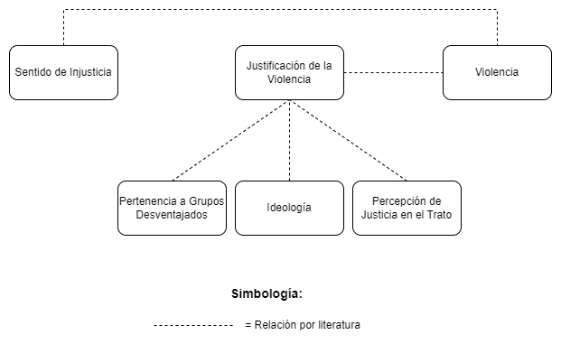
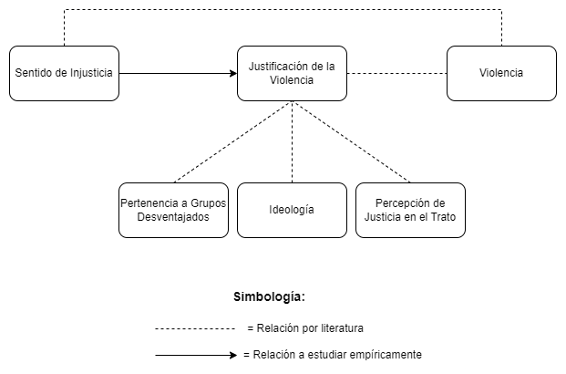
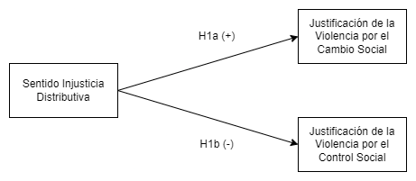
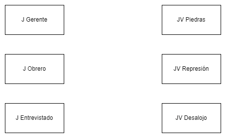
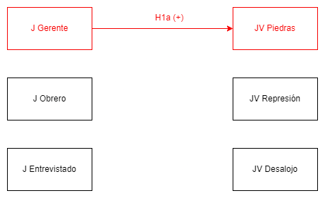
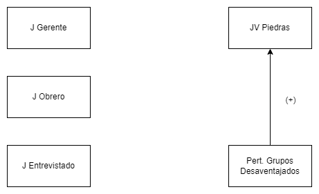
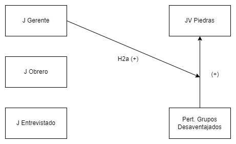

```{r setup, include=FALSE,eval=TRUE}
options(htmltools.dir.version = FALSE)
```

```{r xaringan-themer, include=FALSE, warning=FALSE}
library(xaringanthemer)
library("xaringanExtra")
library("fontawesome")
xaringanExtra::use_progress_bar(color = "red", location = "bottom")
```
class: inverse

# ¿Quién justifica qué? _El rol del sentido de injusticia en las justificaciones de violencia en contexto de protesta_ <br>

.medium[.orange[**Martín Venegas Márquez** (martin.venegas@ug.uchile.cl)]]


.small[Facultad de Ciencias Sociales, Universidad de Chile] <br> 


***
.medium[[.orange[_Exámen de Título - **Segundo Semestre 2022**_]](https://github.com/formacionciudadana)]<br>
.medium[Noviembre, 2022]

---
class: slideInRight, middle, inverse

***
# Contenidos
***

- **Problematización**

- **Pregunta e Hipótesis** 

- **Método**

- **Resultados**

- **Discusión y Conclusiones**
---

class: slideInRight, middle, inverse

***
# Problematización
***

### .medium[Contexto y Antecedentes]
### .medium[Este estudio]

---
class: slideInRight, middle, inverse

***
# Problematización
***

### [**Contexto y Antecedentes**]()
### .medium[Este estudio]

---
# Justificación de la Violencia en Contexto de Protesta

--
[**Definiciones:**]() Violencia como ejercicio intencional del daño (Bufacchi, 2005).

--

[**Contexto Local (estalido social):**]() Aumenta la justificación de tácticas de protesta violenta y disminuye la justificación de tácticas represivas de parte de carabineros (ELSOC, 2019)

--

[**Consecuencias:**]() Quienes justifican la violencia son más tendientes a ejercerla (Nunes et al., 2021) o a condonar el acto violento de otros (Kalmoe, 2014) → _Escalada de violencia que amenace la convivencia pacifica_

--

### **¿Quienes y por qué justifican la violencia?**

---
class: slideInRight, middle, inverse

***
# Problematización
***

### .medium[Contexto y Antecedentes]
### .medium[Este estudio]

---
# Distinción Principal

--

En la literatura empírica se distingue la justificación de la violencia de acuerdo a sus **fines**

--

.pull-left[### [**Justificación de la Violencia por el Cambio Social**]()

Aquella que busca generar cambios en las estructuras jerárquicas de la sociedad (Blumenthal, 1973; Gerber et al. 2017)
]
--

.pull-right[### [**Justificación de la Violencia por el Control Social**]() 

Aquella que busca mantener las estructuras jerárquicas de las sociedad. (Blumenthal, 1973; Gerber et al. 2017)
]
---

# Tres explicaciones desde la literatura

--

1. **Enfoque criminológico de las teorías del conflicto social:** Personas de más bajos estatus o pertenecientes a grupos minoritarios tienden a apoyar menos el _uso de la fuerza por parte de la policía_ (Arthur & Case, 1994; Thompson, 2004)

--

2. **Enfoque de teorías de Autoritarismo de Derecha (RWA) y Dominancia Social (SDO):** Personas con ideologías más autoritarias (RWA) y dominantes (SDO) tienden a justificar más el _uso de la fuerza excesiva por parte de la policía_ (Gerber & Jackson, 2016)

--

3. **Enfoque de justicia procesal:** Mayores percepciones de justicia procesal están asociadas a mayor _justificación de la violencia_ por el control social, y menos por el cambio social (Gerber et al., 2017).

---
class: slideInRight, middle, inverse

***
# Problematización
***

### .medium[Contexto y Antecedentes]
### [**Este Estudio**]()
---
# Este estudio

--

## Premisa 

--

.large[### La justicia no es un concepto unidimensional, sino uno multidimensional (Törnblom & Vermunt, 2007) ] 

--

Las dos dimensiones más trabajadas en la literatura:  

  + **Distributiva:** Justicia en la distribución de recompensas (generalmente ingresos) (Jasso, 2015)
  
  + **Procesal:** Justicia en el trato a personas (generalmente de parte de autoridades) (Tyler & Blader, 2003)
  
---
# Este estudio
## Propuesta 

--

### Integrar la justicia distributiva como una dimensión explicativa de las justificaciones de la violencia

--

### Pero... ¿por qué?

---

# Este estudio: Planteamiento Lógico

--

- Las ideas de justicia distributiva son una fuerza social que motivan el comportamiento humano a nivel individual y agregado (Liebig & Sauer, 2016; Runciman 1966; Barrington Moore, 1988; Tausch et al., 2011)

--

#### .center[Injusticia Distributiva → Acción]

--

- Quienes justifican la violencia son más tendientes a ejercerla o a condonar la violencia de otros (Nunes et al., 2021)

--

#### .center[Justificación → Acción]

--

- Entonces, _alguien que ejerce violencia en función de su sentimiento de injusticia distributiva debería previamente justificarla_

--

#### .center[Injusticia Distributiva → Justificación → Acción]

---
# Literatura hasta ahora...

.center[]
---
# Literatura hasta ahora...

.center[]
---
# Literatura hasta ahora...

.center[]
---
class: slideInRight, middle, inverse

***
# Pregunta e Hipótesis
***
---
# Pregunta

> ¿Cuál es la relación entre el sentido de injusticia distributiva y las justificaciones de la violencia en contexto de protesta, tanto por el cambio social, como por el control social, en Chile al año 2019?

---
class: slideInRight, middle, inverse

***
# Hipótesis
***
---
# Hipótesis

--

$H_{1a}$: Individuos que evalúen la distribución de ingresos como más injusta tenderán a justificar más la violencia por el cambio social.

--

$H_{1b}$: Individuos que evalúen la distribución de ingresos como menos injusta tenderán a justificar más la violencia por el control social.

--

.center[]

---
# Hipótesis

--

$H_{2a}$: Individuos pertenecientes a grupos desaventajados tenderán a justificar más la violencia por el cambio social cuando evalúen la distribución de ingresos como más injusta.

--

$H_{2b}$: Individuos pertenecientes a grupos desaventajados tenderán a justificar menos la violencia por el control social cuando evalúen la distribución de ingresos como más injusta

--

.center[]
---
class: slideInRight, middle, inverse

***
# Método
***
---
# Datos 

--

  - Encuesta Longitudinal Social de Chile - Ola 4 (2019)
  - 716 casos válidos para el análisis (sin NA en las variables relevantes)

--

# Técnicas de análisis

--

- **Descriptivos:** Análisis frecuenicas, medias y correlaciones
- **Multivariados:** Regresiones logisticas ordinales con efectos de interacción

---

# Variables Dependientes

--

¿En qué medida cree usted que se justifican o no se justifican las siguientes situaciones?

--
.pull-left[**Justificación de la Violencia por el Cambio Social**

_1. Que estudiantes tiren piedras a carabineros en una marcha por la educación del país_.   
  
]
  
--
  
.pull-right[**Justificación de la Violencia por el Control Social**

 _2. Que carabineros desaloje a la fuerza a los estudiantes de un liceo en toma_.  
  
 _3. Que carabineros use la fuerza para reprimir una manifestación pacifica_.
 
]

--

.center[Likert: (1) Nunca se justifica a (5) Siempre se justifica.]
---
# Variables Independientes

--

**Preguntas sobre ingresos reales y justos para: el entrevistado, un obrero no calificado, un gerente de una gran empresa**

--

**Sentido de Injusticia Distributiva**

\begin{equation}
   \text{J}_{i}= ln(\frac{\text{Ingresos Reales}_{i}}{\text{Ingresos Justos}_{i}})
\end{equation}

--

Siendo $J_{i}$ la evaluación de justicia $J$ para un individuo ${i}$ → A mayor valor en el indicador, más injusticia se evalúa.

--

- $J_{entrevistado}$  

--

- $J_{obrero}$

--

- $J_{gerente}$  
---
# Controles

--

.pull-left[**Pertenencia a grupos desaventajados**  
Sexo (Mujer)  
Ingresos (Bajos Ingresos)  
Nivel educacional (Bajo Nivel)
Pertenencia a Pueblo Originario (Mapuche)  
]

.pull-right[
**Ideología**  

Indice RWA (Autoritarismo)  
Indice SDO (Dominancia Social)  

]

.pull-right[**Percepción de Trato Justo**

¿Con cuánta frecuencia cree usted que personas [grupo o clase del entrevistado] son tratadas con respeto?...

_En los servicios de salud._   
_Por carabineros._   

]
--

---
# Síntesis: Hipótesis y Variables

.center[]

---
class: slideInRight, middle, inverse

***
# Resultados
***
---
# Resultados: Efectos Directos (H1a y H1b)

.center[]
---
# Resultados: Efectos Directos (H1a y H1b)

.center[]
---
# Resultados: Efectos Directos (H1a y H1b)

.center[]

---
# Resultados: Efecto Moderador (H2a y H2b)

.center[]
---
# Resultados: Efecto Moderador (H2a y H2b)

.center[]
---
# Resultados: Efecto Moderador (H2a y H2b)

.center[]
---
class: slideInRight, middle, inverse

***
# Discusión y Conclusiones
***
---

# Aportes Generales

--

**1. Aporte a la literatura de justificación de la violencia:**  Establecer a la justicia distributiva como una dimensión explicativa en los estudios de justificación de la violencia → _mirar la otra cara de la moneda (nueva línea de investigación)_

--

**2. Aporte a la literatura de justicia distributiva:** Incorporar a la justificación de la violencia dentro de las posibles consecuencias de evaluar injusticia en la distribución de ingresos

---
# Aportes Específicos

### Sentido Injusticia Gerente y Justificación de la Violencia por el Cambio Social

--

- Independiente de la pertenencia a grupos desaventajados, la ideología y las percepciones de justicia en el trato, quienes consideran que los gerentes están injustamente sobre recompensados justifican más la violencia por el cambio social 

--

- Cuando la injusticia distributiva es una razón por la que se justifique la violencia por el cambio, **las personas miran hacia arriba y no hacia abajo**.

--

- Imagen del clima del momento: descontento generalizado con _los poderosos_
---
# Aportes Específicos

### Sentido Injusticia Obrero y Justificación de la Violencia por el Control Social

--

-  Quienes justifican la violencia de carabineros basados en sus evaluaciones de justicia distributiva siguen una lógica racional → **Si es que no hay nada malo (en la situación de los más desfavorecidos), entonces no hay nada que cambiar**

--

- Cuando la situación es represión en marchas pacificas, el efecto se controla por ideología: efecto de la proporcionalidad de la violencia, consistente con Gerber & Jackson (2016)
---
# Conclusiones

- Existe un efecto directo que varía de acuerdo cuál es la situación de injusticia que se evalúa y la situación de violencia que se observa

- Hallazgos de efecto directos van en linea con el clima de los tiempos del estallido social

- Existe un efecto moderador que va en contra de la hipótesis propuesta → posible error de selección de variables, profundizar en en futuros estudios

- Profundizar el estudio de estas relaciones con datos longitudinales y otras formas de medición y metodologías.

---
class: slideInRight, middle, inverse, center

# ¡Muchas Gracias!
---

class: slideInRight, middle, inverse

***
# Referencias
***
---

# Referencias

- Arthur, J. A., & Case, C. E. (1994). Race, class and support for police use of force. Crime, Law and Social Change, 21, 167–182. https://doi.org/10.1007/BF01307910
- Barrington Moore, Jr. (1978). Injustice: The Social Bases of Obedience and Revolt. The Macmillan Press Ltd.
- Basaure, M. (2020). Justificación de la violencia política: Propuesta de un modelo teórico social. Revista de Sociología, 35(1), 20–30. https://doi.org/10.5354/0719-529x.2020.58104
- Blumenthal, M. D. (1972). Predicting attitudes toward violence. Science, 176(4041), 1296–1303. https://doi.org/10.1126/science.176.4041.1296
- Bufacchi, V. (2005). Two Concepts of Violence. Political Studies Review, 3(2), 193–204. https://doi.org/10.1111/j.1478-9299.2005.00023.x
- Frazer, E., & Hutchings, K. (2019). Can Political Violence Ever Be Justified? Polity Press.
---
# Referencias

- Gerber, M., González, R., Carvacho, H., Jiménez-Moya, G., & Jackson, J. (2017). On the justification of intergroup violence: The roles of procedural justice, police legitimacy and group identity in attitudes towards violence among indigenous people. Psychology of Violence, 8(3), 379–389. https://doi.org/10.1037/vio0000177
- Gerber, M., & Jackson, J. (2016). Justifying violence: legitimacy, ideology and public support for police use of force. Psychology, Crime and Law, 23(1), 79–95. https://doi.org/10.1080/1068316X.2016.1220556
- Jasso, G. (2015). Thinking, Saying, Doing in the World of Distributive Justice. Social Justice Research, 28(4), 435–478. https://doi.org/10.1007/s11211-015-0257-3
- Kalmoe, N. P. (2014). Fueling the Fire : Violent Metaphors , Trait Aggression , and Support for Political Violence. Political Communication, 31(4), 545–563. https://doi.org/10.1080/10584609.2013.852642
- Liebig, S., & Sauer, C. (2016). Sociology of justice. In Handbook of social justice theory and research (pp. 37-59). Springer, New York, NY.

---
# Referencias

- Nunes, K. L., Pedneault, C. I., & Hermann, C. A. (2021). Do Attitudes Toward Violence Affect Violent Behavior? Journal of Aggression, Maltreatment and Trauma, 00(00), 1–16. https://doi.org/10.1080/10926771.2021.2019158
- Runciman, W. (1966). Relative Deprivation and Social Justice. A Study of Attitudes to Social Inequality in Twentieth Century England. Routledge & Kegan Paul.
- Tausch, N., Becker, J. C., Spears, R., Christ, O., Saab, R., Singh, P., & Siddiqui, R. N. (2011). Explaining Radical Group Behavior: Developing Emotion and Efficacy Routes to Normative and Nonnormative Collective Action. Journal of Personality and Social Psychology, 101(1), 129–148. https://doi.org/10.1037/a0022728
- Thompson, B. L., Alabama, S., Lee, J. D., & Alabama, S. (2004). Who Cares If Police Become Violent? Explaining of Police Use of Force Using a National Sample. Sociological Inquiry, 74(3), 381–410.
- Törnblom, K. Y., & Vermunt, R. (2007). Distributive and Procedural Justice. Ashgate
- Tyler, T. R., & Blader, S. L. (2003). The Group Engagement Model: Procedural Justice, Social Identity, and Cooperative Behavior.
---
class: slideInRight, middle, inverse

***
# Anexos
***

---

# Descriptivos: Justificación Violenica

```{r pjv, echo=FALSE, message=FALSE, warning=FALSE, fig.cap="Frecuencias de Justificación de la Violencia", fig.width=10}

load(url("https://github.com/thesis-justification-of-violence/thesis-analysis/raw/main/input/data/procjv_analysis_nona.RData"))

load(url("https://github.com/thesis-justification-of-violence/thesis-analysis/raw/main/input/data/procjv_nums_nona.RData"))

if (!require("pacman")) install.packages("pacman")  #si falta pacman, instalar
if (!require("tinytex")) install.packages("tinytex")#si falta tinytex, instalar
pacman::p_load(knitr, kableExtra, dplyr, lavaan, sjPlot, ordinal, sjmisc, sjlabelled, ggrepel, readxl, MASS, brant) # librerias
knitr::opts_chunk$set(warning = FALSE,  # mensaje de warning
                      message = FALSE,  # mensajes/avisos de librerias  
                      cache = FALSE,    # cache de los chunks,usar analisis pesados
                      # out.width = '50%',# largo de imagen en %
                      fig.pos= "H",     # posicion figuras H = HERE
                      echo = FALSE      # incluir chunk en output
)

# Otras configuraciones
options(scipen=999) # notacion cientifica
options(knitr.kable.NA = '') # NA en kable = ''

  # update.packages("sjPlot") # please install version 2.8.9 or above
  ggplot2::theme_set(ggplot2::theme(panel.background = ggplot2::element_rect(fill = "gray85",
                                                                             colour = "gray85"),
                                    panel.border = ggplot2::element_blank(),
                                    axis.text.y = ggplot2::element_text(size = 11,
                                                                        hjust = 1),
                                    title = ggplot2::element_text(size = 11,
                                                                  face = "bold"),
                                    legend.text = ggplot2::element_text(size = 10),
                                    plot.caption = ggplot2::element_text(size = 9,
                                                                         face = "plain",
                                                                         hjust = 1)))
  #Plot : Perception of meritocracy student and family
  
  data_plot <- dplyr::select(procjv_nums_nona, 
                      jv_est_2019,
                      jv_carab1_2019,
                      jv_carab2_2019)
  
  data_plot$jv_est_2019 <- factor(data_plot$jv_est_2019, levels = c(5,4,3,2,1), labels = c("Siempre", "Muchas veces", "Algunas veces", "Pocas veces", "Nunca"))
  data_plot$jv_est_2019 <- set_label(data_plot$jv_est_2019, label = "JV: Piedras")

  data_plot$jv_carab1_2019 <- factor(data_plot$jv_carab1_2019, levels = c(5,4,3,2,1), labels = c("Siempre", "Muchas veces", "Algunas veces", "Pocas veces", "Nunca"))
  data_plot$jv_carab1_2019 <- set_label(data_plot$jv_carab1_2019, label = "JV: Represion")
  
  data_plot$jv_carab2_2019 <- factor(data_plot$jv_carab2_2019, levels = c(5,4,3,2,1), labels = c("Siempre", "Muchas veces", "Algunas veces", "Pocas veces", "Nunca"))
  data_plot$jv_carab2_2019 <- set_label(data_plot$jv_carab2_2019, label = "JV: Desalojo")
  
  pjv<-
    data_plot%>%
    dplyr::select(jv_est_2019,
           jv_carab1_2019,
           jv_carab2_2019) %>%
    sjPlot::plot_likert(geom.colors = "PuBu",
                        geom.size = 0.8,
                        catcount = 5,
                        # axis.labels = c("JV: Estudiantes lancen piedras","JV: Carabineros repriman marchas ","JV: Carabineros desalojen tomas"),
                        # legend.labels = c("Nunca","Pocas veces","Algunas veces","Muchas veces","Siempre"),
                        # grid.range  =  c(1.2 , 1.2),
                        values  =  "sum.outside",
                        reverse.colors = F,
                        reverse.scale = F,
                        show.n = FALSE) +
    # guides(colour = guide_legend(reverse = TRUE))
    theme(legend.position="bottom") +
    labs(caption =
           paste0("Fuente: Elaboración propia  a partir de ELSOC 2019"," (n=",dim(na.omit(procjv_analysis_nona))[1],")")) + guides(colour = guide_legend(reverse = TRUE)) + theme_bw()
  
  sjPlot::plot_grid(list(pjv),tags = c("",""))
```

---

# Descriptivos: Sentido Injusticia

```{r den-sj, echo=FALSE, fig.cap="Distribución del sentido de injusticia", fig.width=10}
load(url("https://github.com/thesis-justification-of-violence/thesis-analysis/raw/main/input/data/procjv_analysis_nona.RData"))

load(url("https://github.com/thesis-justification-of-violence/thesis-analysis/raw/main/input/data/procjv_nums_nona.RData"))

if (!require("pacman")) install.packages("pacman")  #si falta pacman, instalar
if (!require("tinytex")) install.packages("tinytex")#si falta tinytex, instalar
pacman::p_load(knitr, kableExtra, dplyr, lavaan, sjPlot, ordinal, sjmisc, sjlabelled, ggrepel) # librerias
knitr::opts_chunk$set(warning = FALSE,  # mensaje de warning
                      message = FALSE,  # mensajes/avisos de librerias  
                      cache = FALSE,    # cache de los chunks,usar analisis pesados
                      # out.width = '50%',# largo de imagen en %
                      fig.pos= "H",     # posicion figuras H = HERE
                      echo = FALSE      # incluir chunk en output
)

# Otras configuraciones
options(scipen=999) # notacion cientifica
options(knitr.kable.NA = '') # NA en kable = ''


 # update.packages("sjPlot") # please install version 2.8.9 or above
  ggplot2::theme_set(ggplot2::theme(panel.background = ggplot2::element_rect(fill = "gray85",
                                                                             colour = "gray85"),
                                    panel.border = ggplot2::element_blank(),
                                    axis.text.y = ggplot2::element_text(size = 13,
                                                                        hjust = 1),
                                    title = ggplot2::element_text(size = 13,
                                                                  face = "bold"),
                                    legend.text = ggplot2::element_text(size = 12),
                                    plot.caption = ggplot2::element_text(size = 10,
                                                                         face = "plain",
                                                                         hjust = 1)))
a <- data.frame(procjv_nums_nona$sj_obrero_rec);
a$grupo <- "Obrero"
names(a) <- c("promedio","Recompensado:")

b <- data.frame(procjv_nums_nona$sj_ceo);
b$grupo <- "Gerente"
names(b) <- c("promedio","Recompensado:")

c <- data.frame(procjv_nums_nona$sj_entrevistado_rec);
c$grupo <- "Entrevistado"
names(c) <- c("promedio","Recompensado:")

df_sj<- rbind(c,b,a)
  ggplot(df_sj) +
  geom_density(aes(x=promedio,fill=`Recompensado:`
), alpha=0.4) +
  scale_x_continuous(name = "Sentido de Injusticia (J)",
                     breaks=-5:5,
                     labels = as.character(-5:5)) +
  ylab("Density")+
  theme(legend.position="bottom") + theme_classic() +
    labs(caption =
           paste0("Fuente: Elaboración propia  a partir de ELSOC 2019"," (n=",dim(na.omit(procjv_analysis_nona))[1],")"))
  
```

---

# Descriptivos: Medias J x JV Piedras

```{r sj-jvcamb, fig.cap="Medias del Sentido de Injusticia por Justificación de la Violencia por el Cambio Social", fig.width=10}
# table1::table1(~sj_obrero + sj_ceo + sj_entrevistado | jv_est_2019_factor, data = procjv_analysis_nona, caption = "Just. Viol. Cambio. - Que estudiantes lancen piedras a carabineros")

# df_plot_jvest <- procjv_analysis_nona %>%
#   group_by(jv_est_2019_factor) %>%
#   summarise_at(vars(sj_ceo, sj_obrero_rec, sj_entrevistado_rec), list(name = mean))

if (!require("pacman")) install.packages("pacman")  #si falta pacman, instalar
if (!require("tinytex")) install.packages("tinytex")#si falta tinytex, instalar
pacman::p_load(knitr, kableExtra, dplyr, lavaan, sjPlot, ordinal, sjmisc, sjlabelled, ggrepel) # librerias
knitr::opts_chunk$set(warning = FALSE,  # mensaje de warning
                      message = FALSE,  # mensajes/avisos de librerias  
                      cache = FALSE,    # cache de los chunks,usar analisis pesados
                      # out.width = '50%',# largo de imagen en %
                      fig.pos= "H",     # posicion figuras H = HERE
                      echo = FALSE      # incluir chunk en output
)


df <- data.frame(x=c(1, 2, 3, 4, 5, 
                     1, 2, 3, 4, 5, 
                     1, 2, 3, 4, 5),
                 y=c(1.08, 1.02, 1.36, 1.52, 1.86, 
                     0.62, 0.72, 0.71, 0.62, 0.61, 
                     0.47, 0.51, 0.52, 0.50, 0.51),
                 Recompensado = c("Gerente", "Gerente","Gerente","Gerente","Gerente",
                       "Obrero", "Obrero", "Obrero", "Obrero", "Obrero", 
                       "Entrevistado", "Entrevistado","Entrevistado","Entrevistado","Entrevistado"))

#create scatterplot with a label on every point
ggplot(df, aes(x,y,group =Recompensado, name = Recompensado, color = Recompensado)) +
  geom_line(color = "gray")+
  geom_point(aes(colour = Recompensado), size = 4) +
  geom_text_repel(aes(label = y)) +
  labs(y = "Sentido de Injusticia (J)", x = "JV: Piedras", Recompensado="") + theme_classic() +
  ggtitle("") + 
  scale_x_continuous(breaks = c(1,2,3,4,5), labels=c("Nunca", 
                            "Pocas veces", 
                            "Algunas veces", 
                            "Muchas veces",
                            "Siempre")) +
    labs(caption =
           paste0("Fuente: Elaboración propia  a partir de ELSOC 2019"," (n=",dim(na.omit(procjv_analysis_nona))[1],")"))


```

---

# Descriptivos: Medias J x JV Represión

```{r sj-jvcon1, fig.cap = "Medias del Sentido de Injusticia por Jusitificación de la Violencia por el Control Social 1", fig.width=10}

#table1::table1(~sj_obrero_rec + sj_ceo + sj_entrevistado_rec | jv_carab1_2019_factor, data = procjv_analysis_nona, caption = "Just. Viol. Control - Carabineros reprima marchas")

if (!require("pacman")) install.packages("pacman")  #si falta pacman, instalar
if (!require("tinytex")) install.packages("tinytex")#si falta tinytex, instalar
pacman::p_load(knitr, kableExtra, dplyr, lavaan, sjPlot, ordinal, sjmisc, sjlabelled, ggrepel) # librerias
knitr::opts_chunk$set(warning = FALSE,  # mensaje de warning
                      message = FALSE,  # mensajes/avisos de librerias  
                      cache = FALSE,    # cache de los chunks,usar analisis pesados
                      # out.width = '50%',# largo de imagen en %
                      fig.pos= "H",     # posicion figuras H = HERE
                      echo = FALSE      # incluir chunk en output
)


df <- data.frame(x=c(1, 2, 3, 4, 5, 
                     1, 2, 3, 4, 5, 
                     1, 2, 3, 4, 5),
                 y=c(1.16, 0.97, 1.08, 1.19, 0.50, 
                     0.68, 0.56, 0.54, 0.59, 0.41, 
                     0.51, 0.39, 0.44, 0.56, 0.29),
                 Recompensado = c("Gerente", "Gerente","Gerente","Gerente","Gerente",
                       "Obrero", "Obrero", "Obrero", "Obrero", "Obrero", 
                       "Entrevistado", "Entrevistado","Entrevistado","Entrevistado","Entrevistado"))

#create scatterplot with a label on every point
ggplot(df, aes(x,y,group =Recompensado, name = Recompensado, color = Recompensado)) +
  geom_line(color = "gray")+
  geom_point(aes(colour = Recompensado), size = 4) +
  geom_text_repel(aes(label = y)) +
  labs(y = "Sentido de Injusticia (J)", x = "JV: Represion", Recompensado="") + theme_classic() +
  ggtitle("") + 
  scale_x_continuous(breaks = c(1,2,3,4,5), labels=c("Nunca", 
                            "Pocas veces", 
                            "Algunas veces", 
                            "Muchas veces",
                            "Siempre")) +
    labs(caption =
           paste0("Fuente: Elaboración propia  a partir de ELSOC 2019"," (n=",dim(na.omit(procjv_analysis_nona))[1],")"))


```

---

# Descriptivos: Medias J x JV Desalojo

```{r sj-jvcon2, fig.cap = "Medias del Sentido de Injusticia por Jusitificación de la Violencia por el Control Social 2", fig.width=10}

#table1::table1(~sj_obrero_rec + sj_ceo + sj_entrevistado_rec | jv_carab2_2019_factor, data = procjv_analysis_nona, caption = "Just. Viol. Control - Carabineros desaloje liceos en toma")

if (!require("pacman")) install.packages("pacman")  #si falta pacman, instalar
if (!require("tinytex")) install.packages("tinytex")#si falta tinytex, instalar
pacman::p_load(knitr, kableExtra, dplyr, lavaan, sjPlot, ordinal, sjmisc, sjlabelled, ggrepel) # librerias
knitr::opts_chunk$set(warning = FALSE,  # mensaje de warning
                      message = FALSE,  # mensajes/avisos de librerias  
                      cache = FALSE,    # cache de los chunks,usar analisis pesados
                      # out.width = '50%',# largo de imagen en %
                      fig.pos= "H",     # posicion figuras H = HERE
                      echo = FALSE      # incluir chunk en output
)

df <- data.frame(x=c(1, 2, 3, 4, 5, 
                     1, 2, 3, 4, 5, 
                     1, 2, 3, 4, 5),
                 y=c(1.19, 0.99, 1.07, 1.24, 0.77, 
                     0.69, 0.61, 0.57, 0.46, 0.50, 
                     0.53, 0.44, 0.43, 0.39, 0.29),
                 Recompensado = c("Gerente", "Gerente","Gerente","Gerente","Gerente",
                       "Obrero", "Obrero", "Obrero", "Obrero", "Obrero", 
                       "Entrevistado", "Entrevistado","Entrevistado","Entrevistado","Entrevistado"))

#create scatterplot with a label on every point
ggplot(df, aes(x,y,group =Recompensado, name = Recompensado, color = Recompensado)) +
  geom_line(color = "gray")+
  geom_point(aes(colour = Recompensado), size = 4) +
  geom_text_repel(aes(label = y)) +
  labs(y = "Sentido de Injusticia (J)", x = "JV: Desalojo", Recompensado="") + theme_classic() +
  ggtitle("") + 
  scale_x_continuous(breaks = c(1,2,3,4,5), labels=c("Nunca", 
                            "Pocas veces", 
                            "Algunas veces", 
                            "Muchas veces",
                            "Siempre")) +
    labs(caption =
           paste0("Fuente: Elaboración propia a partir de ELSOC 2019"," (n=",dim(na.omit(procjv_analysis_nona))[1],")"))


```
---

# Multivariados: JV Cambio Social

.pull-left[
```{r}  

# Cargar paquetes necesarios
pacman::p_load(ordinal,
               sjPlot)

# Cargar datos necesarios
load(url("https://github.com/thesis-justification-of-violence/thesis-analysis/raw/main/input/data/procjv_analysis_nona.RData"))

# Estudiantes tiren piedras

jv_est_2019.modelmulpub4<- clm(jv_est_2019_factor ~ 
                                 sj_ceo_rec + 
                                 sj_obrero_rec + 
                                 sj_entrevistado_rec + 
                                 ingreso + 
                                 sexo_factor + 
                                 ingreso_satisfact_factor + 
                                 educ_rec_factor + 
                                 indigena_rec_factor + 
                                 sdo_indice + 
                                 rwa_indice + 
                                 trato_salud_factor + 
                                 trato_carab_factor, 
                               data = procjv_analysis_nona)

jv_est_2019.modelmulpub5<- clm(jv_est_2019_factor ~ 
                                 sj_ceo_rec + 
                                 sj_obrero_rec + 
                                 sj_entrevistado_rec + 
                                 ingreso + 
                                 sexo_factor + 
                                 ingreso_satisfact_factor + 
                                 educ_rec_factor + 
                                 indigena_rec_factor + 
                                 sdo_indice + 
                                 rwa_indice + 
                                 trato_salud_factor + 
                                 trato_carab_factor + 
                                 sexo_factor*sj_ceo_rec + 
                                 ingreso_satisfact_factor*sj_ceo_rec, 
                               data = procjv_analysis_nona)

plot_model(jv_est_2019.modelmulpub5, title = "Coeficientes de Regresión para Estudiantes Tiren Piedras", vline.color = "gray", show.values = TRUE, value.offset = .3, terms = c("sj_ceo_rec", "sj_obrero_rec", "sj_entrevistado_rec", "ingreso_satisfact_factorTotalmente insatisfecho", "rwa_indice", "trato_carab_factorSiempre", "sj_ceo_rec:ingreso_satisfact_factorTotalmente insatisfecho")
           
,axis.labels =
c("J Gerente x Sat. Ing.: Tot. Insatis",
  "Trato Justo: Siempre",
  "RWA",
  "Sat. Ing.: Tot. Insatis.",
  "J Entrevistado",
  "J Obrero",
  "J Gerente")
)
            
```
]

.pulll-right[

Solo la evaluación de injusticia de los gerentes (J Gerente) tiene un efecto significativo  

A medida que aumenta la evaluación de que la distribución de los ingresos de los gerentes es injusta, las chances de que se justifique que estudiantes tiren piedras a carabineros aumentan (H1a ✓)

El efecto se mantiene controlando por los predictores relevantes por literatura y las interacciones  

Las interacciones van en el sentido contrario a la hipótesis (H2a ✗)
]
---

# Multivariados: JV Control Social


.pull-left[
```{r}

# Cargar paquetes necesarios
pacman::p_load(ordinal,
               sjPlot)

# Cargar datos necesarios
load(url("https://github.com/thesis-justification-of-violence/thesis-analysis/raw/main/input/data/procjv_analysis_nona.RData"))

 jv_carab1_2019.modelmulpub2<- clm(jv_carab1_2019_factor ~ 
                                     sj_ceo_rec + 
                                     sj_obrero_rec + 
                                     sj_entrevistado_rec + 
                                     ingreso + 
                                     sexo_factor + 
                                     ingreso_satisfact_factor + 
                                     educ_rec_factor + 
                                     indigena_rec_factor, 
                                   data = procjv_analysis_nona)
 
jv_carab1_2019.modelmulpub3<- clm(jv_carab1_2019_factor ~ 
                                    sj_ceo_rec + 
                                    sj_obrero_rec + 
                                    sj_entrevistado_rec + 
                                    ingreso + 
                                    sexo_factor + 
                                    ingreso_satisfact_factor + 
                                    educ_rec_factor + 
                                    indigena_rec_factor + 
                                    sdo_indice + 
                                    rwa_indice, 
                                  data = procjv_analysis_nona)

gridExtra::grid.arrange(
plot_model(jv_carab1_2019.modelmulpub2, title = "Coeficientes de Regresión para Carabineros Reprimen Marchas (Solo J)", vline.color = "gray", show.values = TRUE, value.offset = .3, terms = c("sj_ceo_rec", "sj_obrero_rec", "sj_entrevistado_rec")
           
,axis.labels =
c(
  "J Entrevistado",
  "J Obrero",
  "J Gerente")
)
,
plot_model(jv_carab1_2019.modelmulpub3, title = "Coeficientes de Regresión para Carabineros Carabineros Reprimen Marchas (J + Ideología)", vline.color = "gray", show.values = TRUE, value.offset = .3, terms = c("sj_ceo_rec", "sj_obrero_rec", "sj_entrevistado_rec", "rwa_indice", "sdo_indice")
           
,axis.labels =
c(
  "SDO",
  "RWA",
  "J Entrevistado",
  "J Obrero",
  "J Gerente")
)

)      

```
]

.pull-right[

Solo la evaluación de injusticia de los obreros (J Obreros) tiene un efecto significativo  

A medida que aumenta la evaluación de que la distribución de los ingresos de los obreros es injusta, las chances de que se justifique que carabineros reprima una marcha pacifica disminuye (H1b ✓)

El efecto se controla por la ideología autoritaria (RWA) y dominante (SDO)

]
---

# Multivariados: JV Control Social

.pull-left[
```{r}
# Cargar paquetes necesarios
pacman::p_load(ordinal,
               sjPlot)

# Cargar datos necesarios
load(url("https://github.com/thesis-justification-of-violence/thesis-analysis/raw/main/input/data/procjv_analysis_nona.RData"))

# Carabineros desalojen tomas

jv_carab2_2019.modelmulpub4<- clm(jv_carab2_2019_factor ~ 
                                    sj_ceo_rec + 
                                    sj_obrero_rec +
                                    sj_entrevistado_rec + 
                                    ingreso +
                                    sexo_factor + 
                                    ingreso_satisfact_factor + 
                                    educ_rec_factor +
                                    indigena_rec_factor +
                                    sdo_indice + 
                                    rwa_indice + 
                                    trato_salud_factor +
                                    trato_carab_factor, 
                                  data = procjv_analysis_nona)


plot_model(jv_carab2_2019.modelmulpub4, title = "Coeficientes de Regresión para Carabineros Desalojen Tomas", vline.color = "gray", show.values = TRUE, value.offset = .3, terms = c("sj_ceo_rec", "sj_obrero_rec", "sj_entrevistado_rec", "rwa_indice", "sdo_indice")
           
,axis.labels =
c(
  "SDO",
  "RWA",
  "J Entrevistado",
  "J Obrero",
  "J Gerente")
)

```
]

.pull-left[

Solo la evaluación de injusticia de los obreros (J Obreros) tiene un efecto significativo  

A medida que aumenta la evaluación de que la distribución de los ingresos de los obreros es injusta, las chances de que se justifique que carabineros desaloje liceos en toma disminuye (H1b ✓)

El efecto se mantiene al controlar por las variables relevantes por literatura  
]
---

# Multivariados: JV Cambio Social


.pull-left[
```{r predjvest4}

load(url("https://github.com/thesis-justification-of-violence/thesis-analysis/raw/main/input/data/procjv_analysis_nona.RData"))

jv_est_2019.modelmulpub4<- clm(jv_est_2019_factor ~ 
                                 sj_ceo_rec + 
                                 sj_obrero_rec + 
                                 sj_entrevistado + 
                                 ingreso + 
                                 sexo_factor + 
                                 ingreso_satisfact_factor + 
                                 educ_rec_factor + 
                                 indigena_rec_factor + 
                                 sdo_indice + 
                                 rwa_indice + 
                                 trato_salud_factor + 
                                 trato_carab_factor, 
                               data = procjv_analysis_nona)

plot_pred_jvest_4 <- plot_model(jv_est_2019.modelmulpub4, type = "pred", terms = c("sj_ceo_rec[all]"), title = "")  + geom_line() + theme(legend.position="bottom") + ylab("Probabilidad Predicha")

plot_pred_jvest_4$data$response.level[plot_pred_jvest_4$data$response.level == 1] <- "1. Nunca"
plot_pred_jvest_4$data$response.level[plot_pred_jvest_4$data$response.level == 2] <- "2. Pocas veces"
plot_pred_jvest_4$data$response.level[plot_pred_jvest_4$data$response.level == 3] <- "3. Algunas veces"
plot_pred_jvest_4$data$response.level[plot_pred_jvest_4$data$response.level == 4] <- "4. Muchas veces"
plot_pred_jvest_4$data$response.level[plot_pred_jvest_4$data$response.level == 5] <- "5. Siempre"

plot_pred_jvest_4 + theme_classic()


```

]

.pull-right[

**A medida que aumenta la evaluación de que los gerentes están injustamente sobrerecompensados...**  

...disminuye la probabilidad de responder que _nunca se justifica_ que estudiantes tiren piedras a carabineros (controlando por variables relevantes)  

...aumenta la probabilidad de responder que _muchas veces se justifica_ esta situación

]

---

# Multivariados: JV Control Social


.pull-left[
```{r predcarab1_2}

load(url("https://github.com/thesis-justification-of-violence/thesis-analysis/raw/main/input/data/procjv_analysis_nona.RData"))


 jv_carab1_2019.modelmulpub2<- clm(jv_carab1_2019_factor ~ 
                                     sj_ceo_rec + 
                                     sj_obrero_rec + 
                                     sj_entrevistado + 
                                     ingreso + 
                                     sexo_factor + 
                                     ingreso_satisfact_factor + 
                                     educ_rec_factor + 
                                     indigena_rec_factor, 
                                   data = procjv_analysis_nona)

plot_pred_carab1_2 <- plot_model(jv_carab1_2019.modelmulpub2, type = "pred", terms = c("sj_obrero_rec[all]"), title = "")  + geom_line() + theme(legend.position="bottom") + ylab("Probabilidad Predicha")

plot_pred_carab1_2$data$response.level[plot_pred_carab1_2$data$response.level == 1] <- "1. Nunca"
plot_pred_carab1_2$data$response.level[plot_pred_carab1_2$data$response.level == 2] <- "2. Pocas veces"
plot_pred_carab1_2$data$response.level[plot_pred_carab1_2$data$response.level == 3] <- "3. Algunas veces"
plot_pred_carab1_2$data$response.level[plot_pred_carab1_2$data$response.level == 4] <- "4. Muchas veces"
plot_pred_carab1_2$data$response.level[plot_pred_carab1_2$data$response.level == 5] <- "5. Siempre"

plot_pred_carab1_2 + theme_classic()


```
]

.pull-left[

**A medida que aumenta la evaluación de que los obreros están injustamente subrerecompensados...**  

...aumenta la probabilidad de responder que _nunca se justifica_ que carabineros reprima marchas pacificas (controlando por variables relevantes)  

...disminuye la probabilidad de responder que _muchas veces se justifica_ esta situación

]

---

# Multivariados: JV Control Social


.pull-left[
```{r predcarab2_4}

load(url("https://github.com/thesis-justification-of-violence/thesis-analysis/raw/main/input/data/procjv_analysis_nona.RData"))


jv_carab2_2019.modelmulpub4<- clm(jv_carab2_2019_factor ~ 
                                    sj_ceo_rec + 
                                    sj_obrero_rec +
                                    sj_entrevistado_rec + 
                                    ingreso +
                                    sexo_factor + 
                                    ingreso_satisfact_factor + 
                                    educ_rec_factor +
                                    indigena_rec_factor +
                                    sdo_indice + 
                                    rwa_indice + 
                                    trato_salud_factor +
                                    trato_carab_factor, 
                                  data = procjv_analysis_nona)

plot_pred_carab2_4 <- plot_model(jv_carab2_2019.modelmulpub4, type = "pred", terms = c("sj_obrero_rec[all]"), title = "")  + geom_line() + theme(legend.position="bottom") + ylab("Probabilidad Predicha")

plot_pred_carab2_4$data$response.level[plot_pred_carab2_4$data$response.level == 1] <- "1. Nunca"
plot_pred_carab2_4$data$response.level[plot_pred_carab2_4$data$response.level == 2] <- "2. Pocas veces"
plot_pred_carab2_4$data$response.level[plot_pred_carab2_4$data$response.level == 3] <- "3. Algunas veces"
plot_pred_carab2_4$data$response.level[plot_pred_carab2_4$data$response.level == 4] <- "4. Muchas veces"
plot_pred_carab2_4$data$response.level[plot_pred_carab2_4$data$response.level == 5] <- "5. Siempre"

plot_pred_carab2_4 + theme_classic()
```
]

.plot-right[
**A medida que aumenta la evaluación de que los obreros están injustamente subrerecompensados... ** 

...aumenta la probabilidad de responder que _nunca se justifica_ que carabineros desaloje tomas estudiantiles (controlando por variables relevantes  

...disminuye la probabilidad de responder que _muchas veces se justifica_ esta situación

]

