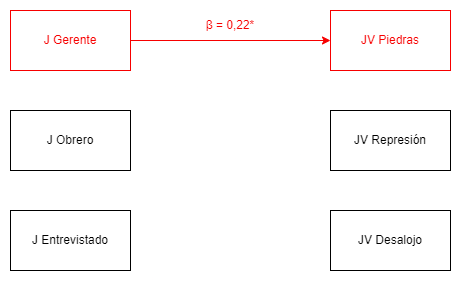
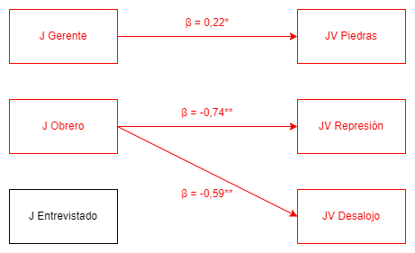
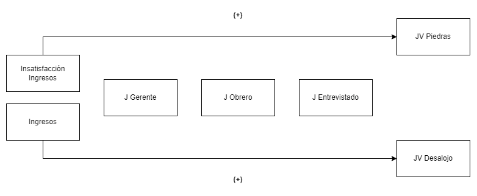
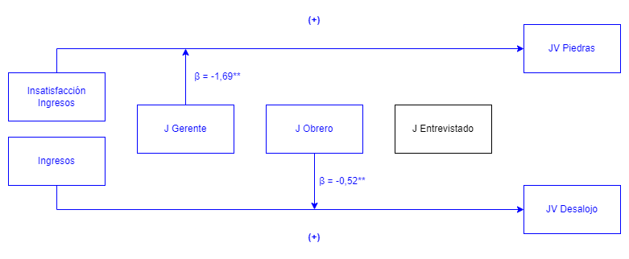
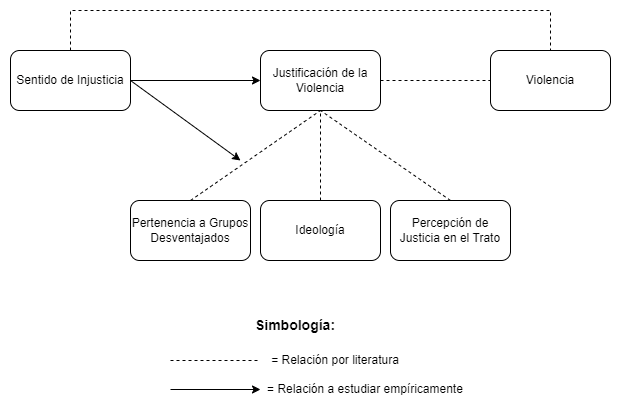

```{r setup, include=FALSE,eval=TRUE}
options(htmltools.dir.version = FALSE)
```

```{r xaringan-themer, include=FALSE, warning=FALSE}
library(xaringanthemer)
library("xaringanExtra")
library("fontawesome")
xaringanExtra::use_progress_bar(color = "red", location = "bottom")
```
class: inverse

# ¿Quién justifica qué? _El rol del sentido de injusticia en las justificaciones de violencia en contexto de protesta_ <br>

.medium[.orange[**Martín Venegas Márquez** (martin.venegas@ug.uchile.cl)]]  


.small[Facultad de Ciencias Sociales, Universidad de Chile] <br> 


***
.medium[[.orange[_Exámen para optar al título de Sociólogo  - **Segundo Semestre 2022**_]](https://github.com/formacionciudadana)]<br>
.medium[Comisión: Dr. Juan Carlos Castillo, Dr. Rodrigo Asún y Dra. Emmanuelle Barozet]  
.medium[Noviembre, 2022]

---
class: slideInRight, middle, inverse

***
# Contenidos
***

- **Problematización**

- **Método y Resultados**

- **Discusión y Conclusiones**

- **Respuesta a Comentarios**
---

class: slideInRight, middle, inverse

***
# Problematización
***

### .medium[Contexto y Antecedentes]
### .medium[Este estudio]

---
class: slideInRight, middle, inverse

***
# Problematización
***

### [**Contexto y Antecedentes**]()
### .medium[Este estudio]

---
# Justificación de la Violencia en Contexto de Protesta

--
[**Definiciones:**]() Violencia como ejercicio intencional del daño (Bufacchi, 2005).

--

[**Contexto local (estallido social):**]() Aumenta la justificación de tácticas de protesta violenta y disminuye la justificación de tácticas represivas de parte de carabineros (ELSOC, 2020)

--

[**Consecuencias:**]() Quienes justifican la violencia son más tendientes a ejercerla (Nunes et al., 2021) → _Escalada de violencia que amenace la convivencia pacifica_

--

### **¿Quienes y por qué justifican la violencia?**

---
# Distinción Principal

--

.large[En la literatura empírica se distingue la justificación de la violencia de acuerdo a sus **fines**]

--

.pull-left[### [**Justificación de la Violencia por el Cambio Social**]()

Aquella que busca generar cambios en las estructuras jerárquicas de la sociedad (Blumenthal, 1973; Gerber et al. 2017)
]
--

.pull-right[### [**Justificación de la Violencia por el Control Social**]() 

Aquella que busca mantener las estructuras jerárquicas de las sociedad. (Blumenthal, 1973; Gerber et al. 2017)
]
---

# Tres explicaciones desde la literatura


.large[**Pertenencia a grupos desaventajados** relacionado a un menor apoyo al _uso de la fuerza por parte de la policía_ (Arthur & Case, 1994; Thompson, 2004)]

.large[**Ideologías (RWA y SDO)** relacionadas positivamente a una mayor justificación del _uso de la fuerza excesiva por parte de la policía_ (Gerber & Jackson, 2016)]

.large[**Percepción de justicia en el trato** asociadas positivamente a mayor _justificación de la violencia_ por el control social, y menos por el cambio social (Gerber et al., 2017).]

---
class: slideInRight, middle, inverse

***
# Problematización
***

### .medium[Contexto y Antecedentes]
### [**Este Estudio**]()
---
# Este estudio

.large[[**Premisa:**]() La justicia no es un concepto unidimensional, sino uno multidimensional (Törnblom & Vermunt, 2007)]

  + *Distributiva:* Justicia en la distribución de recompensas (generalmente ingresos) (Jasso, 2015)
  
  + *Procesal:* Justicia en el trato a personas (generalmente de parte de autoridades) (Tyler & Blader, 2003)
  
--
  
.xlarge[[**Propuesta:**]() Integrar la justicia distributiva como una dimensión explicativa de las justificaciones de la violencia]
  
---
class: roja, middle
 
.xlarge[**¿Cuál es la <span style="color:black">relación</span> entre el <span style="color:black">sentido de injusticia distributiva</span> y las <span style="color:black">justificaciones de la violencia</span> en contexto de protesta , tanto por el cambio social, como por el control social, en Chile al año 2019?**]

---
# Hipótesis


$H_{1a}$: Individuos que evalúen la distribución de ingresos como más injusta tenderán a justificar más la violencia por el cambio social.


$H_{1b}$: Individuos que evalúen la distribución de ingresos como menos injusta tenderán a justificar más la violencia por el control social.

.center[]

---
# Hipótesis

$H_{2a}$: Individuos pertenecientes a grupos desaventajados tenderán a justificar más la violencia por el cambio social cuando evalúen la distribución de ingresos como más injusta.


$H_{2b}$: Individuos pertenecientes a grupos desaventajados tenderán a justificar menos la violencia por el control social cuando evalúen la distribución de ingresos como más injusta

.center[]
---
class: slideInRight, middle, inverse

***
# Método
***
---
# Datos 

.large[- Encuesta Longitudinal Social de Chile - Ola 4 (2019)
]
.large[- 716 casos válidos para el análisis (sin NA en las variables relevantes)
]

# Técnicas de análisis


.large[- **Descriptivos:** Análisis frecuencias, medias y correlaciones
]
.large[- **Multivariados:** Regresiones logísticas ordinales con efectos de interacción
]

---

# Variables Dependientes

--

¿En qué medida cree usted que se justifican o no se justifican las siguientes situaciones?

--

.pull-left[**Justificación de la Violencia por el Cambio Social**

_1. Que estudiantes tiren piedras a carabineros en una marcha por la educación del país_.   
  
]
  
--

.pull-right[**Justificación de la Violencia por el Control Social**

 _2. Que carabineros use la fuerza para reprimir una manifestación pacifica_.  
 
 _3. Que carabineros desaloje a la fuerza a los estudiantes de un liceo en toma_.  
 
]

--

.center[Likert: (1) Nunca se justifica a (5) Siempre se justifica.]
---
# Variables Independientes


Preguntas sobre ingresos reales y justos para: el entrevistado, un obrero no calificado, un gerente de una gran empresa


**Sentido de Injusticia Distributiva**

\begin{equation}
   \text{J}_{i}= ln(\frac{\text{Ingresos Reales}_{i}}{\text{Ingresos Justos}_{i}})
\end{equation}


Siendo $J_{i}$ la evaluación de justicia $J$ para un individuo ${i}$ → A mayor valor en el indicador, más injusticia se evalúa.

--

- $J_{entrevistado}$  


- $J_{obrero}$


- $J_{gerente}$  
---
# Controles

.pull-left[**Pertenencia a grupos desaventajados**  
Sexo (Mujer)  
Ingresos (Bajos Ingresos)  
Nivel educacional (Bajo Nivel)
Pertenencia a Pueblo Originario (Mapuche)  
]

.pull-right[
**Ideología**  

Indice RWA (Autoritarismo)  
Indice SDO (Dominancia Social)  

]

.pull-right[**Percepción de Trato Justo**

¿Con cuánta frecuencia cree usted que personas [grupo o clase del entrevistado] son tratadas con respeto?...

_En los servicios de salud._   
_Por carabineros._   

]
--

---
class: slideInRight, middle, inverse

***
# Resultados
***
---
# Frecuencias Justificación de la Violencia

.center[

```{r pjv, echo=FALSE, message=FALSE, warning=FALSE, fig.cap="Frecuencias de Justificación de la Violencia", fig.width=10}

load(url("https://github.com/thesis-justification-of-violence/thesis-analysis/raw/main/input/data/procjv_analysis_nona.RData"))

load(url("https://github.com/thesis-justification-of-violence/thesis-analysis/raw/main/input/data/procjv_nums_nona.RData"))

if (!require("pacman")) install.packages("pacman")  #si falta pacman, instalar
if (!require("tinytex")) install.packages("tinytex")#si falta tinytex, instalar
pacman::p_load(knitr, kableExtra, dplyr, lavaan, sjPlot, ordinal, sjmisc, sjlabelled, ggrepel, readxl, MASS, brant) # librerias
knitr::opts_chunk$set(warning = FALSE,  # mensaje de warning
                      message = FALSE,  # mensajes/avisos de librerias  
                      cache = FALSE,    # cache de los chunks,usar analisis pesados
                      # out.width = '50%',# largo de imagen en %
                      fig.pos= "H",     # posicion figuras H = HERE
                      echo = FALSE      # incluir chunk en output
)

# Otras configuraciones
options(scipen=999) # notacion cientifica
options(knitr.kable.NA = '') # NA en kable = ''

  # update.packages("sjPlot") # please install version 2.8.9 or above
  ggplot2::theme_set(ggplot2::theme(panel.background = ggplot2::element_rect(fill = "gray85",
                                                                             colour = "gray85"),
                                    panel.border = ggplot2::element_blank(),
                                    axis.text.y = ggplot2::element_text(size = 11,
                                                                        hjust = 1),
                                    title = ggplot2::element_text(size = 11,
                                                                  face = "bold"),
                                    legend.text = ggplot2::element_text(size = 10),
                                    plot.caption = ggplot2::element_text(size = 9,
                                                                         face = "plain",
                                                                         hjust = 1)))
  #Plot : Perception of meritocracy student and family
  
  data_plot <- dplyr::select(procjv_nums_nona, 
                      jv_est_2019,
                      jv_carab1_2019,
                      jv_carab2_2019)
  
  data_plot$jv_est_2019 <- factor(data_plot$jv_est_2019, levels = c(5,4,3,2,1), labels = c("Siempre", "Muchas veces", "Algunas veces", "Pocas veces", "Nunca"))
  data_plot$jv_est_2019 <- set_label(data_plot$jv_est_2019, label = "JV: Piedras")

  data_plot$jv_carab1_2019 <- factor(data_plot$jv_carab1_2019, levels = c(5,4,3,2,1), labels = c("Siempre", "Muchas veces", "Algunas veces", "Pocas veces", "Nunca"))
  data_plot$jv_carab1_2019 <- set_label(data_plot$jv_carab1_2019, label = "JV: Represion")
  
  data_plot$jv_carab2_2019 <- factor(data_plot$jv_carab2_2019, levels = c(5,4,3,2,1), labels = c("Siempre", "Muchas veces", "Algunas veces", "Pocas veces", "Nunca"))
  data_plot$jv_carab2_2019 <- set_label(data_plot$jv_carab2_2019, label = "JV: Desalojo")
  
  pjv<-
    data_plot%>%
    dplyr::select(jv_est_2019,
           jv_carab1_2019,
           jv_carab2_2019) %>%
    sjPlot::plot_likert(geom.colors = "PuBu",
                        geom.size = 0.8,
                        catcount = 5,
                        # axis.labels = c("JV: Estudiantes lancen piedras","JV: Carabineros repriman marchas ","JV: Carabineros desalojen tomas"),
                        # legend.labels = c("Nunca","Pocas veces","Algunas veces","Muchas veces","Siempre"),
                        # grid.range  =  c(1.2 , 1.2),
                        values  =  "sum.outside",
                        reverse.colors = F,
                        reverse.scale = F,
                        show.n = FALSE) +
    # guides(colour = guide_legend(reverse = TRUE))
    theme(legend.position="bottom") +
    labs(caption =
           paste0("Fuente: Elaboración propia  a partir de ELSOC 2019"," (n=",dim(na.omit(procjv_analysis_nona))[1],")")) + guides(colour = guide_legend(reverse = TRUE)) + theme_bw()
  
  sjPlot::plot_grid(list(pjv),tags = c("",""))
```

]

---
# Resultados: Efectos Directos

.center[]

.center[<font size="2">**JV Piedras:** Modelo 4 (incluye controles, sin interacciones). 0.05 = \*; 0.01 = \*\*; 0.001 = \*\*\*</font>]
.center[<font size="2">&nbsp;</font>]
.center[<font size="2">&nbsp;</font>]

**H1a:**  
**H1b:**
---
# Resultados: Efectos Directos

.center[]

.center[<font size="2"> **JV Piedras:** Modelo 4 (incluye controles, sin interacciones). 0.05 = \*; 0.01 = \*\*; 0.001 = \*\*\*</font>] 
.center[<font size="2">&nbsp;</font>]
.center[<font size="2">&nbsp;</font>]

**H1a:** ✓  
**H1b:**
---
# Resultados: Efectos Directos

.center[]

.center[<font size="2"> **JV Piedras:** Modelo 4 (incluye controles, sin interacciones). 0.05 = \*; 0.01 = \*\*; 0.001 = \*\*\*</font>] 
.center[<font size="2"> **JV Represión:** Modelo 2: (controla por pert. grupo. des.). 0.05 = \*; 0.01 = \*\*; 0.001 = \*\*\*</font>]
.center[<font size="2"> **JV Desalojo:** Modelo 4: (incluye controles, sin interacciones). 0.05 = \*; 0.01 = \*\*; 0.001 = \*\*\*</font>]

**H1a:** ✓  
**H1b:** ✓
---
# Resultados: Efecto Moderador

.center[]

.center[<font size="2">Modelo 5 (incluye controles e interacciones). 0.05 = \*; 0.01 = \*\*; 0.001 = \*\*\*</font>]

**H2a:**  
**H2b:**
---
# Resultados: Efecto Moderador

.center[]

.center[<font size="2">Modelo 5 (incluye controles e interacciones). 0.05 = \*; 0.01 = \*\*; 0.001 = \*\*\*</font>]

**H2a:** ✗  
**H2b:**
---
# Resultados: Efecto Moderador

.center[]

.center[<font size="2">Modelo 5 (incluye controles e interacciones). 0.05 = \*; 0.01 = \*\*; 0.001 = \*\*\*</font>]

**H2a:** ✗  
**H2b:** ✗
---
class: slideInRight, middle, inverse

***
# Discusión y Conclusiones
***
---
# Discusión

### Sentido Injusticia Gerente y Justificación de la Violencia por el Cambio Social (H1a)

--

- Independiente de la pertenencia a grupos desaventajados, la ideología y las percepciones de justicia en el trato, quienes consideran que los gerentes están injustamente sobre recompensados justifican más la violencia por el cambio social 

--

- **¿Dónde _miran_ las personas?** → arriba, no abajo

--

- **Imagen del clima del momento** → descontento generalizado con _los poderosos_
---
# Discusión

### Sentido Injusticia Obrero y Justificación de la Violencia por el Control Social (H1b)

--

- **Lógica racional** → Si es que no hay algo malo (en la situación de los más desfavorecidos), entonces no hay nada que cambiar

--

- **Proporcionalidad de la violencia** → Efecto controlado por ideología en situación de represión marchas pacificas. Consistente con Gerber & Jackson (2016).
---
# Discusión

### Pertenencia a Grupos Desaventajados, Sentido de Injusticia y Justificación de la Violencia (H2)

--

- **Efecto atenuante en vez de potenciador:** moderación en sentido contrario a la hipótesis

--

- ¿Elección de indicadores o efecto real? 

--
  - _Satisfacción con los ingresos_ → Variable subjetiva que puede no representar el concepto
  
  - _Sexo_ → Según literatura, mujeres justifican menos la violencia independiente del fin
  
  - _Ingresos_ → Complejidades que escapan a la hipótesis (e.g. relación actores-contexto)
  

---
class: roja, middle

# <span style="color:white"> Conclusiones</span>

--

**<font size="6"><span style="color:black">1. Literatura de justificación de la violencia:</span>** un punto de partida  </font>


--

**<font size="6"><span style="color:black">2. Literatura de justicia distributiva:</span>** evidencia de una nueva relación  </font>

--

**<font size="6"><span style="color:black">3. Proyecciones:</span>** datos longitudinales, otras mediciones/metodologías y OLES  </font>

---
class: slideInRight, middle, inverse

***
# Respuesta a Comentarios
***
---
# [Comentario]()

### Distribución asimétrica de respuesta

# [Respuesta]()

- **Limitante que debe reconocerse** → ligada al constructo que se busca medir

- **Mejores propuestas de escalas** →  *Casi siempre* en vez de *Siempre* (Gerber et al., 2016) 

- **Resultados se mantienen** → Replicación análisis con otras técnicas

  - Ejemplo: Logit Binario donde 0 = "Nunca" y 1 = "Siempre", "Muchas veces", "Algunas veces", "Pocas veces")

---


.pull-left[
```{r}  

# Cargar paquetes necesarios
pacman::p_load(ordinal,
               sjPlot,
               ggplot2)

# Cargar datos necesarios
load(url("https://github.com/thesis-justification-of-violence/thesis-analysis/raw/main/input/data/procjv_analysis_nona.RData"))

# Estudiantes tiren piedras

jv_est_2019.modelmulpub5<- clm(jv_est_2019_factor ~ 
                                 sj_ceo_rec + 
                                 sj_obrero_rec + 
                                 sj_entrevistado_rec + 
                                 ingreso + 
                                 sexo_factor + 
                                 ingreso_satisfact_factor + 
                                 educ_rec_factor + 
                                 indigena_rec_factor + 
                                 sdo_indice + 
                                 rwa_indice + 
                                 trato_salud_factor + 
                                 trato_carab_factor + 
                                 sexo_factor*sj_ceo_rec + 
                                 ingreso_satisfact_factor*sj_ceo_rec, 
                               data = procjv_analysis_nona)

plot_model(jv_est_2019.modelmulpub5, 
           transform = NULL,
           title = "Ordinal: Justificación Estudiantes Tiren Piedras", 
           vline.color = "gray", 
           show.values = TRUE, 
           value.offset = .3, 
           terms = c(
             "sj_ceo_rec", 
             "sj_obrero_rec", 
             "sj_entrevistado_rec",
             "sexo_factorMujer",
             "ingreso_satisfact_factorTotalmente insatisfecho", 
             "sj_ceo_rec:sexo_factorMujer",
             "sj_ceo_rec:ingreso_satisfact_factorTotalmente insatisfecho")
           
,axis.labels =
c("J Gerente x Sat. Ing.: Tot. Insatis",
  "J Gerente x Sexo: Mujer",
  "Sat. Ing.: Tot. Insatis.",
  "Sexo: Mujer",
  "J Entrevistado",
  "J Obrero",
  "J Gerente")
) + theme_bw()
            
```
]


.pull-right[
```{r}  

# Cargar paquetes necesarios
pacman::p_load(ordinal,
               sjPlot,
               ggplot2)

# Cargar datos necesarios
load(url("https://github.com/thesis-justification-of-violence/thesis-analysis/raw/main/input/data/procjv_analysis_nona.RData"))

# Recode
procjv_analysis_nona$jv_est_2019_bin[procjv_analysis_nona$jv_est_2019_factor == "Nunca se justifica"] <- 0
procjv_analysis_nona$jv_est_2019_bin[procjv_analysis_nona$jv_est_2019_factor == "Pocas veces se justifica"] <- 1
procjv_analysis_nona$jv_est_2019_bin[procjv_analysis_nona$jv_est_2019_factor == "Algunas veces se justifica"] <- 1
procjv_analysis_nona$jv_est_2019_bin[procjv_analysis_nona$jv_est_2019_factor == "Muchas veces se justifica"] <- 1
procjv_analysis_nona$jv_est_2019_bin[procjv_analysis_nona$jv_est_2019_factor == "Siempre se justifica"] <- 1

# Estudiantes tiren piedras

jv_est_2019.modelmulpub5<- glm(jv_est_2019_bin ~ 
                                 sj_ceo_rec + 
                                 sj_obrero_rec + 
                                 sj_entrevistado_rec + 
                                 ingreso + 
                                 sexo_factor + 
                                 ingreso_satisfact_factor + 
                                 educ_rec_factor + 
                                 indigena_rec_factor + 
                                 sdo_indice + 
                                 rwa_indice + 
                                 trato_salud_factor + 
                                 trato_carab_factor + 
                                 sexo_factor*sj_ceo_rec + 
                                 ingreso_satisfact_factor*sj_ceo_rec, 
                               family = "binomial",
                               data = procjv_analysis_nona)

plot_model(jv_est_2019.modelmulpub5, 
           transform = NULL,
           title = "Binario: Justificación Estudiantes Tiren Piedras", 
           vline.color = "gray", 
           show.values = TRUE, 
           value.offset = .3, 
           terms = c(
             "sj_ceo_rec", 
             "sj_obrero_rec", 
             "sj_entrevistado_rec",
             "sexo_factorMujer",
             "ingreso_satisfact_factorTotalmente insatisfecho", 
             "sj_ceo_rec:sexo_factorMujer",
             "sj_ceo_rec:ingreso_satisfact_factorTotalmente insatisfecho")
           
,axis.labels =
c("J Gerente x Sat. Ing.: Tot. Insatis",
  "J Gerente x Sexo: Mujer",
  "Sat. Ing.: Tot. Insatis.",
  "Sexo: Mujer",
  "J Entrevistado",
  "J Obrero",
  "J Gerente")
) + theme_bw()
            
```
]

.center[<font size="2"> Modelo 5 (incluye controles e interacciones). 0.05 = \*; 0.01 = \*\*; 0.001 = \*\*\*</font>]

---

.pull-left[
```{r}  

# Cargar paquetes necesarios
pacman::p_load(ordinal,
               sjPlot,
               ggplot2)

# Cargar datos necesarios
load(url("https://github.com/thesis-justification-of-violence/thesis-analysis/raw/main/input/data/procjv_analysis_nona.RData"))

# Estudiantes tiren piedras


jv_carab2_2019.modelmulpub5<- clm(jv_carab2_2019_factor ~ 
                                    sj_ceo_rec + 
                                    sj_obrero_rec + 
                                    sj_entrevistado_rec + 
                                    ingreso +
                                    sexo_factor + 
                                    ingreso_satisfact_factor +
                                    educ_rec_factor + 
                                    indigena_rec_factor + 
                                    sdo_indice + 
                                    rwa_indice +
                                    trato_salud_factor + 
                                    trato_carab_factor + 
                                    ingreso*sj_obrero_rec + 
                                    ingreso_satisfact_factor*sj_obrero_rec,
                                  data = procjv_analysis_nona)

plot_model(jv_carab2_2019.modelmulpub5, 
           transform = NULL,
           title = "Ordinal: Justificación Carabineros Desalojen Tomas", 
           vline.color = "gray", 
           show.values = TRUE, 
           value.offset = .3, 
           terms = c(
             "sj_ceo_rec", 
             "sj_obrero_rec", 
             "sj_entrevistado_rec",
             "ingreso",
             "sj_obrero_rec:ingreso"
             )
           
,axis.labels =
c(
  "J Obrero x Ingresos",
  "Ingresos",
  "J Entrevistado",
  "J Obrero",
  "J Gerente"
  )
) + theme_bw()
            
```
]


.pull-right[
```{r}  

# Cargar paquetes necesarios
pacman::p_load(ordinal,
               sjPlot,
               ggplot2)

# Cargar datos necesarios
load(url("https://github.com/thesis-justification-of-violence/thesis-analysis/raw/main/input/data/procjv_analysis_nona.RData"))

# Recode
procjv_analysis_nona$jv_carab2_2019_bin[procjv_analysis_nona$jv_carab2_2019_factor == "Nunca se justifica"] <- 0
procjv_analysis_nona$jv_carab2_2019_bin[procjv_analysis_nona$jv_carab2_2019_factor == "Pocas veces se justifica"] <- 1
procjv_analysis_nona$jv_carab2_2019_bin[procjv_analysis_nona$jv_carab2_2019_factor == "Algunas veces se justifica"] <- 1
procjv_analysis_nona$jv_carab2_2019_bin[procjv_analysis_nona$jv_carab2_2019_factor == "Muchas veces se justifica"] <- 1
procjv_analysis_nona$jv_carab2_2019_bin[procjv_analysis_nona$jv_carab2_2019_factor == "Siempre se justifica"] <- 1

# Estudiantes tiren piedras

jv_carab2_2019.modelmulpub5<- glm(jv_carab2_2019_bin ~ 
                                    sj_ceo_rec + 
                                    sj_obrero_rec + 
                                    sj_entrevistado_rec + 
                                    ingreso +
                                    sexo_factor + 
                                    ingreso_satisfact_factor +
                                    educ_rec_factor + 
                                    indigena_rec_factor + 
                                    sdo_indice + 
                                    rwa_indice +
                                    trato_salud_factor + 
                                    trato_carab_factor + 
                                    ingreso*sj_obrero_rec + 
                                    ingreso_satisfact_factor*sj_obrero_rec,
                                  family = "binomial",
                                  data = procjv_analysis_nona)

plot_model(jv_carab2_2019.modelmulpub5, 
           transform = NULL,
           title = "Binario: Justificación Carabineros Desalojen Tomas", 
           vline.color = "gray", 
           show.values = TRUE, 
           value.offset = .3, 
           terms = c(
             "sj_ceo_rec", 
             "sj_obrero_rec", 
             "sj_entrevistado_rec",
             "ingreso",
             "sj_obrero_rec:ingreso"
             )
           
,axis.labels =
c(
  "J Obrero x Ingresos",
  "Ingresos",
  "J Entrevistado",
  "J Obrero",
  "J Gerente"
  )
) + theme_bw()
            
```
]

.center[<font size="2"> Modelo 5 (incluye controles e interacciones). 0.05 = \*; 0.01 = \*\*; 0.001 = \*\*\*</font>]

---
# [Comentario]()
### Ingresos con β = 0 y SE = 0

# [Respuesta]()

- **Unidad de medida pequeña** → por cada peso... 
  
- **Re-escalamiento de la variable** →  salarios mínimos al 2019 (300.000 pesos)

- **Coeficientes más informativos** → Ej. JV Desalojo (Modelo 2): *β = 0,08; p < 0,05*

---
# [Comentario]()
### Parsimonia de los análisis

# [Respuesta]()

- **¿Con o sin interacciones?** → parsimonia o complejidad  

- **Test de Verosimilitud** → M4 (sin interacciones) v/s M5 (con interacciones) (ordinal y binario)

  - JV Piedras: M5 ofrece mejor ajuste que M4 (*p < 0.05*)
  
  - JV Desalojo: M5 no ofrece mejor ajuste que M4 (*p > 0.05*)  
  
---
class: roja, middle

# <span style="color:white"> Conclusiones post-comentarios </span>

--

**<font size="6"><span style="color:black"> 1. Datos complejos, difícil relación teoría-empiria </span></font>**

--

**<font size="6"><span style="color:black"> 2. Evidencia para sostener efectos directos (replicación con logit binario) </span></font>**

--

**<font size="6"><span style="color:black"> 3. Menos evidencia para sostener efectos de moderación </span></font>**

---
class: slideInRight, middle, inverse, center

# ¡Muchas Gracias!
---

class: slideInRight, middle, inverse

***
# Referencias
***
---

# Referencias

- Arthur, J. A., & Case, C. E. (1994). Race, class and support for police use of force. Crime, Law and Social Change, 21, 167–182. https://doi.org/10.1007/BF01307910
- Barrington Moore, Jr. (1978). Injustice: The Social Bases of Obedience and Revolt. The Macmillan Press Ltd.
- Blumenthal, M. D. (1972). Predicting attitudes toward violence. Science, 176(4041), 1296–1303. https://doi.org/10.1126/science.176.4041.1296
- Bufacchi, V. (2005). Two Concepts of Violence. Political Studies Review, 3(2), 193–204. https://doi.org/10.1111/j.1478-9299.2005.00023.x
- Gerber, M., González, R., Carvacho, H., Jiménez-Moya, G., & Jackson, J. (2017). On the justification of intergroup violence: The roles of procedural justice, police legitimacy and group identity in attitudes towards violence among indigenous people. Psychology of Violence, 8(3), 379–389. https://doi.org/10.1037/vio0000177
---
# Referencias

- Gerber, M., & Jackson, J. (2016). Justifying violence: legitimacy, ideology and public support for police use of force. Psychology, Crime and Law, 23(1), 79–95. https://doi.org/10.1080/1068316X.2016.1220556
- Jasso, G. (2015). Thinking, Saying, Doing in the World of Distributive Justice. Social Justice Research, 28(4), 435–478. https://doi.org/10.1007/s11211-015-0257-3
- Ladin, K. (2014). Absolute Deprivation. The Wiley Blackwell Encyclopedia of Health, Illness, Behavior, and Society, 4–6. https://doi.org/10.1002/9781118410868.wbehibs505
- Liebig, S., & Sauer, C. (2016). Sociology of justice. In Handbook of social justice theory and research (pp. 37-59). Springer, New York, NY.
- Nunes, K. L., Pedneault, C. I., & Hermann, C. A. (2021). Do Attitudes Toward Violence Affect Violent Behavior? Journal of Aggression, Maltreatment and Trauma, 00(00), 1–16. https://doi.org/10.1080/10926771.2021.2019158

---
# Referencias

- PNUD. (2017). Desiguales. Orígenes, cambios y desafíos de la brecha social en Chile (Vol. 11, pp. 287–301).
- Runciman, W. (1966). Relative Deprivation and Social Justice. A Study of Attitudes to Social Inequality in Twentieth Century England. Routledge & Kegan Paul.
- Tausch, N., Becker, J. C., Spears, R., Christ, O., Saab, R., Singh, P., & Siddiqui, R. N. (2011). Explaining Radical Group Behavior: Developing Emotion and Efficacy Routes to Normative and Nonnormative Collective Action. Journal of Personality and Social Psychology, 101(1), 129–148. https://doi.org/10.1037/a0022728
- Thompson, B. L., Alabama, S., Lee, J. D., & Alabama, S. (2004). Who Cares If Police Become Violent? Explaining of Police Use of Force Using a National Sample. Sociological Inquiry, 74(3), 381–410.
- Törnblom, K. Y., & Vermunt, R. (2007). Distributive and Procedural Justice. Ashgate
- Tyler, T. R., & Blader, S. L. (2003). The Group Engagement Model: Procedural Justice, Social Identity, and Cooperative Behavior.
---
class: slideInRight, middle, inverse

***
# Anexos
***

### .medium[Planteamiento]
### .medium[Gráficos y Análisis]
### .medium[Otros Comentarios]

---
class: slideInRight, middle, inverse

***
# Anexos
***

### [**Planteamiento**]()
### .medium[Gráficos y Análisis]
### .medium[Otros Comentarios]

---
# Evolución Justificación de la Violencia

.center[
```{r justintro, echo=FALSE, message=FALSE, warning=FALSE, fig.cap="Justificación de la Violencia de Carabineros y Manifestantes por año"}
pacman::p_load(tidyverse,sjPlot, sjmisc, sjlabelled, elsoc, ggplot2, ggrepel, ordinal) # librerias
knitr::opts_chunk$set(warning = FALSE,  # mensaje de warning
                      message = FALSE,  # mensajes/avisos de librerias  
                      cache = FALSE,    # cache de los chunks,usar analisis pesados
                      # out.width = '50%',# largo de imagen en %
                      fig.pos= "H",     # posicion figuras H = HERE
                      echo = FALSE      # incluir chunk en output
)
elsoc::load_elsoc('long')
elsoc_long_2016_2021 <-elsoc_long_2016_2021[!(elsoc_long_2016_2021$ola == 5),]
elsoc_long_2016_2021 %>% 
  filter(tipo_atricion == 1 & muestra == 1 & 
           !f05_03 %in% c(-888, -999) & !f05_04 %in% c(-888, -999) & !f05_07 %in% c(-888, -999)) %>% 
  dplyr::select(f05_03, f05_04, f05_07, ola, ponderador02, segmento_disenno, estrato_disenno) %>% 
  pivot_longer(cols = c(f05_03, f05_04, f05_07)) %>% 
  prop(value %in% 4:5, by = c(ola, name), na.rm = TRUE) %>% 
  mutate(name = factor(name,
                       levels = c('f05_03', 'f05_04', 'f05_07'),
                       labels = c('Carabineros use la fuerza para\n reprimir manifestación pacífica',
                                  'Carabineros desaloje a la fuerza\na estudiantes de liceo en toma',
                                  'Estudiantes tiren piedras a Carabi-\nneros en marcha por la educación'))) %>%
  sjlabelled::as_label(ola) %>% 
  ggplot(aes(y = prop, x = ola, color = name, group = name,
             label = scales::percent(prop, accuracy = .1))) +
  theme_bw() + 
  geom_point(size = 1.75) + 
  geom_line() +
  scale_y_continuous(labels = scales::percent,
                     limits = c(0, .5)) +
  ylab(label = NULL) +
  xlab(label = NULL) +
  scale_color_viridis_d(begin = 0, end = .7, option = 'viridis') + 
  ggrepel::geom_text_repel(size = 3, nudge_y = .02) +
  theme(plot.caption = element_text(hjust = 0),
        legend.position = 'top',
        legend.title = element_blank()) +
  
    scale_x_continuous(breaks = c(1,2,3,4), labels=c("2016", 
                            "2017", 
                            "2018", 
                            "2019")) +
  ggtitle(NULL,
        subtitle = 'Porcentaje que responde que Muchas veces o Siempre se justifica' ) +
  labs(caption = 'Fuente: COES (2022) Radiografía del Cambio Social: Análisis de Resultados Longitudinales ELSOC 2016-2021. Presentación de Resultados COES. Enero, Santiago de Chile.\nNota: Se consideran observaciones de individuos sin atrición entre olas. N=7.507 (1.513 individuos)')
```
]

---

# ¿Por qué la justicia distributiva?

--

- Las ideas de justicia distributiva son una fuerza social que motivan el comportamiento humano a nivel individual y agregado (Liebig & Sauer, 2016; Runciman 1966; Barrington Moore, 1988; Tausch et al., 2011)

--

#### .center[Injusticia Distributiva → Acción]

--

- Quienes justifican la violencia son más tendientes a ejercerla o a condonar la violencia de otros (Nunes et al., 2021)

--

#### .center[Justificación → Acción]

--

- Entonces, _alguien que ejerce violencia en función de su sentimiento de injusticia distributiva debería previamente justificarla_

--

#### .center[Injusticia Distributiva → Justificación → Acción]

---
# ¿Por qué la moderación?

--

-  Grupos desaventajados tienden a justificar más la violencia policial (Arthur & Case, 1994).

--

#### .center[Pert. Grupo Desaventajado → Justificación]

--

- Individuos que pertenecen a grupos desaventajados tienden sentir más injusticia  (e.g. privación absoluta (Ladin, 2014)).

--

#### .center[Pert. Grupo Desaventajado → Injusticia Distributiva]

--

- Entonces, _considerando que individuos que pertenecen a grupos desaventajados tienden a sentir más injusticia, se esperaría que la injusticia juegue un rol particularmente importante en que estos individuos justifiquen la violencia_

--

#### .center[Pert. Grupo Desaventajado → Injusticia Distributiva → Justificación]
---

# Literatura hasta ahora...

.center[]
---
# Literatura hasta ahora...

.center[]
---
# Literatura hasta ahora...

.center[]

---
class: slideInRight, middle, inverse

***
# Anexos
***

### .medium[Planteamiento]
### [**Gráficos y Análisis**]()
### .medium[Otros Comentarios]

---

# Descriptivos: Sentido Injusticia

```{r den-sj, echo=FALSE, fig.cap="Distribución del sentido de injusticia", fig.width=10}
load(url("https://github.com/thesis-justification-of-violence/thesis-analysis/raw/main/input/data/procjv_analysis_nona.RData"))

load(url("https://github.com/thesis-justification-of-violence/thesis-analysis/raw/main/input/data/procjv_nums_nona.RData"))

if (!require("pacman")) install.packages("pacman")  #si falta pacman, instalar
if (!require("tinytex")) install.packages("tinytex")#si falta tinytex, instalar
pacman::p_load(knitr, kableExtra, dplyr, lavaan, sjPlot, ordinal, sjmisc, sjlabelled, ggrepel) # librerias
knitr::opts_chunk$set(warning = FALSE,  # mensaje de warning
                      message = FALSE,  # mensajes/avisos de librerias  
                      cache = FALSE,    # cache de los chunks,usar analisis pesados
                      # out.width = '50%',# largo de imagen en %
                      fig.pos= "H",     # posicion figuras H = HERE
                      echo = FALSE      # incluir chunk en output
)

# Otras configuraciones
options(scipen=999) # notacion cientifica
options(knitr.kable.NA = '') # NA en kable = ''


 # update.packages("sjPlot") # please install version 2.8.9 or above
  ggplot2::theme_set(ggplot2::theme(panel.background = ggplot2::element_rect(fill = "gray85",
                                                                             colour = "gray85"),
                                    panel.border = ggplot2::element_blank(),
                                    axis.text.y = ggplot2::element_text(size = 13,
                                                                        hjust = 1),
                                    title = ggplot2::element_text(size = 13,
                                                                  face = "bold"),
                                    legend.text = ggplot2::element_text(size = 12),
                                    plot.caption = ggplot2::element_text(size = 10,
                                                                         face = "plain",
                                                                         hjust = 1)))
a <- data.frame(procjv_nums_nona$sj_obrero_rec);
a$grupo <- "Obrero"
names(a) <- c("promedio","Recompensado:")

b <- data.frame(procjv_nums_nona$sj_ceo);
b$grupo <- "Gerente"
names(b) <- c("promedio","Recompensado:")

c <- data.frame(procjv_nums_nona$sj_entrevistado_rec);
c$grupo <- "Entrevistado"
names(c) <- c("promedio","Recompensado:")

df_sj<- rbind(c,b,a)
  ggplot(df_sj) +
  geom_density(aes(x=promedio,fill=`Recompensado:`
), alpha=0.4) +
  scale_x_continuous(name = "Sentido de Injusticia (J)",
                     breaks=-5:5,
                     labels = as.character(-5:5)) +
  ylab("Density")+
  theme(legend.position="bottom") + theme_classic() +
    labs(caption =
           paste0("Fuente: Elaboración propia  a partir de ELSOC 2019"," (n=",dim(na.omit(procjv_analysis_nona))[1],")"))
  
```

---

# Descriptivos: Medias J x JV Piedras

```{r sj-jvcamb, fig.cap="Medias del Sentido de Injusticia por Justificación de la Violencia por el Cambio Social", fig.width=10}
# table1::table1(~sj_obrero + sj_ceo + sj_entrevistado | jv_est_2019_factor, data = procjv_analysis_nona, caption = "Just. Viol. Cambio. - Que estudiantes lancen piedras a carabineros")

# df_plot_jvest <- procjv_analysis_nona %>%
#   group_by(jv_est_2019_factor) %>%
#   summarise_at(vars(sj_ceo, sj_obrero_rec, sj_entrevistado_rec), list(name = mean))

if (!require("pacman")) install.packages("pacman")  #si falta pacman, instalar
if (!require("tinytex")) install.packages("tinytex")#si falta tinytex, instalar
pacman::p_load(knitr, kableExtra, dplyr, lavaan, sjPlot, ordinal, sjmisc, sjlabelled, ggrepel) # librerias
knitr::opts_chunk$set(warning = FALSE,  # mensaje de warning
                      message = FALSE,  # mensajes/avisos de librerias  
                      cache = FALSE,    # cache de los chunks,usar analisis pesados
                      # out.width = '50%',# largo de imagen en %
                      fig.pos= "H",     # posicion figuras H = HERE
                      echo = FALSE      # incluir chunk en output
)


df <- data.frame(x=c(1, 2, 3, 4, 5, 
                     1, 2, 3, 4, 5, 
                     1, 2, 3, 4, 5),
                 y=c(1.08, 1.02, 1.36, 1.52, 1.86, 
                     0.62, 0.72, 0.71, 0.62, 0.61, 
                     0.47, 0.51, 0.52, 0.50, 0.51),
                 Recompensado = c("Gerente", "Gerente","Gerente","Gerente","Gerente",
                       "Obrero", "Obrero", "Obrero", "Obrero", "Obrero", 
                       "Entrevistado", "Entrevistado","Entrevistado","Entrevistado","Entrevistado"))

#create scatterplot with a label on every point
ggplot(df, aes(x,y,group =Recompensado, name = Recompensado, color = Recompensado)) +
  geom_line(color = "gray")+
  geom_point(aes(colour = Recompensado), size = 4) +
  geom_text_repel(aes(label = y)) +
  labs(y = "Sentido de Injusticia (J)", x = "JV: Piedras", Recompensado="") + theme_classic() +
  ggtitle("") + 
  scale_x_continuous(breaks = c(1,2,3,4,5), labels=c("Nunca", 
                            "Pocas veces", 
                            "Algunas veces", 
                            "Muchas veces",
                            "Siempre")) +
    labs(caption =
           paste0("Fuente: Elaboración propia  a partir de ELSOC 2019"," (n=",dim(na.omit(procjv_analysis_nona))[1],")"))


```

---

# Descriptivos: Medias J x JV Represión

```{r sj-jvcon1, fig.cap = "Medias del Sentido de Injusticia por Jusitificación de la Violencia por el Control Social 1", fig.width=10}

#table1::table1(~sj_obrero_rec + sj_ceo + sj_entrevistado_rec | jv_carab1_2019_factor, data = procjv_analysis_nona, caption = "Just. Viol. Control - Carabineros reprima marchas")

if (!require("pacman")) install.packages("pacman")  #si falta pacman, instalar
if (!require("tinytex")) install.packages("tinytex")#si falta tinytex, instalar
pacman::p_load(knitr, kableExtra, dplyr, lavaan, sjPlot, ordinal, sjmisc, sjlabelled, ggrepel) # librerias
knitr::opts_chunk$set(warning = FALSE,  # mensaje de warning
                      message = FALSE,  # mensajes/avisos de librerias  
                      cache = FALSE,    # cache de los chunks,usar analisis pesados
                      # out.width = '50%',# largo de imagen en %
                      fig.pos= "H",     # posicion figuras H = HERE
                      echo = FALSE      # incluir chunk en output
)


df <- data.frame(x=c(1, 2, 3, 4, 5, 
                     1, 2, 3, 4, 5, 
                     1, 2, 3, 4, 5),
                 y=c(1.16, 0.97, 1.08, 1.19, 0.50, 
                     0.68, 0.56, 0.54, 0.59, 0.41, 
                     0.51, 0.39, 0.44, 0.56, 0.29),
                 Recompensado = c("Gerente", "Gerente","Gerente","Gerente","Gerente",
                       "Obrero", "Obrero", "Obrero", "Obrero", "Obrero", 
                       "Entrevistado", "Entrevistado","Entrevistado","Entrevistado","Entrevistado"))

#create scatterplot with a label on every point
ggplot(df, aes(x,y,group =Recompensado, name = Recompensado, color = Recompensado)) +
  geom_line(color = "gray")+
  geom_point(aes(colour = Recompensado), size = 4) +
  geom_text_repel(aes(label = y)) +
  labs(y = "Sentido de Injusticia (J)", x = "JV: Represion", Recompensado="") + theme_classic() +
  ggtitle("") + 
  scale_x_continuous(breaks = c(1,2,3,4,5), labels=c("Nunca", 
                            "Pocas veces", 
                            "Algunas veces", 
                            "Muchas veces",
                            "Siempre")) +
    labs(caption =
           paste0("Fuente: Elaboración propia  a partir de ELSOC 2019"," (n=",dim(na.omit(procjv_analysis_nona))[1],")"))


```

---

# Descriptivos: Medias J x JV Desalojo

```{r sj-jvcon2, fig.cap = "Medias del Sentido de Injusticia por Jusitificación de la Violencia por el Control Social 2", fig.width=10}

#table1::table1(~sj_obrero_rec + sj_ceo + sj_entrevistado_rec | jv_carab2_2019_factor, data = procjv_analysis_nona, caption = "Just. Viol. Control - Carabineros desaloje liceos en toma")

if (!require("pacman")) install.packages("pacman")  #si falta pacman, instalar
if (!require("tinytex")) install.packages("tinytex")#si falta tinytex, instalar
pacman::p_load(knitr, kableExtra, dplyr, lavaan, sjPlot, ordinal, sjmisc, sjlabelled, ggrepel) # librerias
knitr::opts_chunk$set(warning = FALSE,  # mensaje de warning
                      message = FALSE,  # mensajes/avisos de librerias  
                      cache = FALSE,    # cache de los chunks,usar analisis pesados
                      # out.width = '50%',# largo de imagen en %
                      fig.pos= "H",     # posicion figuras H = HERE
                      echo = FALSE      # incluir chunk en output
)

df <- data.frame(x=c(1, 2, 3, 4, 5, 
                     1, 2, 3, 4, 5, 
                     1, 2, 3, 4, 5),
                 y=c(1.19, 0.99, 1.07, 1.24, 0.77, 
                     0.69, 0.61, 0.57, 0.46, 0.50, 
                     0.53, 0.44, 0.43, 0.39, 0.29),
                 Recompensado = c("Gerente", "Gerente","Gerente","Gerente","Gerente",
                       "Obrero", "Obrero", "Obrero", "Obrero", "Obrero", 
                       "Entrevistado", "Entrevistado","Entrevistado","Entrevistado","Entrevistado"))

#create scatterplot with a label on every point
ggplot(df, aes(x,y,group =Recompensado, name = Recompensado, color = Recompensado)) +
  geom_line(color = "gray")+
  geom_point(aes(colour = Recompensado), size = 4) +
  geom_text_repel(aes(label = y)) +
  labs(y = "Sentido de Injusticia (J)", x = "JV: Desalojo", Recompensado="") + theme_classic() +
  ggtitle("") + 
  scale_x_continuous(breaks = c(1,2,3,4,5), labels=c("Nunca", 
                            "Pocas veces", 
                            "Algunas veces", 
                            "Muchas veces",
                            "Siempre")) +
    labs(caption =
           paste0("Fuente: Elaboración propia a partir de ELSOC 2019"," (n=",dim(na.omit(procjv_analysis_nona))[1],")"))


```
---

# Multivariados: JV Cambio Social

.pull-left[
```{r}  

# Cargar paquetes necesarios
pacman::p_load(ordinal,
               sjPlot)

# Cargar datos necesarios
load(url("https://github.com/thesis-justification-of-violence/thesis-analysis/raw/main/input/data/procjv_analysis_nona.RData"))

# Estudiantes tiren piedras

jv_est_2019.modelmulpub5<- clm(jv_est_2019_factor ~ 
                                 sj_ceo_rec + 
                                 sj_obrero_rec + 
                                 sj_entrevistado_rec + 
                                 ingreso + 
                                 sexo_factor + 
                                 ingreso_satisfact_factor + 
                                 educ_rec_factor + 
                                 indigena_rec_factor + 
                                 sdo_indice + 
                                 rwa_indice + 
                                 trato_salud_factor + 
                                 trato_carab_factor + 
                                 sexo_factor*sj_ceo_rec + 
                                 ingreso_satisfact_factor*sj_ceo_rec, 
                               data = procjv_analysis_nona)

plot_model(jv_est_2019.modelmulpub5, 
           transform = NULL,
           title = "Coeficientes de Regresión para Estudiantes Tiren Piedras (+ Interacciones)", 
           vline.color = "gray", show.values = TRUE, 
           value.offset = .3, 
           terms = c(
             "sj_ceo_rec", 
             "sj_obrero_rec", 
             "sj_entrevistado_rec", 
             "sexo_factorMujer", 
             "rwa_indice", 
             "trato_carab_factorSiempre", 
             "sj_ceo_rec:sexo_factorMujer"
             )
           
,axis.labels =
c(
  "J Gerente x Sexo: Mujer",
  "Trato Justo: Siempre",
  "RWA",
  "Sexo: Mujer",
  "J Entrevistado",
  "J Obrero",
  "J Gerente"
  )
) + theme_bw()
            
```
]

.pulll-right[

A medida que aumenta la evaluación de que la distribución de los ingresos de los gerentes es injusta, las chances de que se justifique que estudiantes tiren piedras a carabineros aumentan (H1a ✓)

Las interacciones van en el sentido contrario a la hipótesis (H2a ✗)
]
---

# Multivariados: JV Control Social


.pull-left[
```{r}

# Cargar paquetes necesarios
pacman::p_load(ordinal,
               sjPlot)

# Cargar datos necesarios
load(url("https://github.com/thesis-justification-of-violence/thesis-analysis/raw/main/input/data/procjv_analysis_nona.RData"))

 jv_carab1_2019.modelmulpub2<- clm(jv_carab1_2019_factor ~ 
                                     sj_ceo_rec + 
                                     sj_obrero_rec + 
                                     sj_entrevistado_rec + 
                                     ingreso + 
                                     sexo_factor + 
                                     ingreso_satisfact_factor + 
                                     educ_rec_factor + 
                                     indigena_rec_factor, 
                                   data = procjv_analysis_nona)
 
jv_carab1_2019.modelmulpub3<- clm(jv_carab1_2019_factor ~ 
                                    sj_ceo_rec + 
                                    sj_obrero_rec + 
                                    sj_entrevistado_rec + 
                                    ingreso + 
                                    sexo_factor + 
                                    ingreso_satisfact_factor + 
                                    educ_rec_factor + 
                                    indigena_rec_factor + 
                                    sdo_indice + 
                                    rwa_indice, 
                                  data = procjv_analysis_nona)

gridExtra::grid.arrange(
plot_model(jv_carab1_2019.modelmulpub2, 
           transform = NULL,
           title = "Coeficientes de Regresión para Carabineros Reprimen Marchas (Solo J)", 
           vline.color = "gray", 
           show.values = TRUE, 
           value.offset = .3, 
           terms = c(
             "sj_ceo_rec", 
             "sj_obrero_rec", 
             "sj_entrevistado_rec"
             )
           
,axis.labels =
c(
  "J Entrevistado",
  "J Obrero",
  "J Gerente"
  )
) + theme_bw()
,
plot_model(jv_carab1_2019.modelmulpub3, 
           transform = NULL,
           title = "Coeficientes de Regresión para Carabineros Carabineros Reprimen Marchas (J + Ideología)", 
           vline.color = "gray", 
           show.values = TRUE, 
           value.offset = .3, 
           terms = c(
             "sj_ceo_rec", 
             "sj_obrero_rec", 
             "sj_entrevistado_rec", 
             "rwa_indice", 
             "sdo_indice"
             )
           
,axis.labels =
c(
  "SDO",
  "RWA",
  "J Entrevistado",
  "J Obrero",
  "J Gerente"
  )
) + theme_bw()

)    

```
]

.pull-right[

A medida que aumenta la evaluación de que la distribución de los ingresos de los obreros es injusta, las chances de que se justifique que carabineros reprima una marcha pacifica disminuye (H1b ✓)  

El efecto se controla por la ideología autoritaria (RWA) y dominante (SDO)  

No se encuentra evidencia para efecto de moderación (H2b ✗)  
]
---

# Multivariados: JV Control Social

.pull-left[
```{r}
# Cargar paquetes necesarios
pacman::p_load(ordinal,
               sjPlot)

# Cargar datos necesarios
load(url("https://github.com/thesis-justification-of-violence/thesis-analysis/raw/main/input/data/procjv_analysis_nona.RData"))

# Carabineros desalojen tomas

jv_carab2_2019.modelmulpub4<- clm(jv_carab2_2019_factor ~ 
                                    sj_ceo_rec + 
                                    sj_obrero_rec +
                                    sj_entrevistado_rec + 
                                    ingreso +
                                    sexo_factor + 
                                    ingreso_satisfact_factor + 
                                    educ_rec_factor +
                                    indigena_rec_factor +
                                    sdo_indice + 
                                    rwa_indice + 
                                    trato_salud_factor +
                                    trato_carab_factor, 
                                  data = procjv_analysis_nona)

jv_carab2_2019.modelmulpub5<- clm(jv_carab2_2019_factor ~ 
                                    sj_ceo_rec + 
                                    sj_obrero_rec + 
                                    sj_entrevistado_rec + 
                                    ingreso +
                                    sexo_factor + 
                                    ingreso_satisfact_factor +
                                    educ_rec_factor + 
                                    indigena_rec_factor + 
                                    sdo_indice + 
                                    rwa_indice +
                                    trato_salud_factor + 
                                    trato_carab_factor + 
                                    ingreso*sj_obrero_rec + 
                                    ingreso_satisfact_factor*sj_obrero_rec,
                                  data = procjv_analysis_nona)


gridExtra::grid.arrange(
  
plot_model(jv_carab2_2019.modelmulpub4, 
           transform = NULL,
           title = "Coeficientes de Regresión para Carabineros Desalojen Tomas (Controles)", 
           vline.color = "gray", 
           show.values = TRUE, 
           value.offset = .3, 
           terms = c(
             "sj_ceo_rec", 
             "sj_obrero_rec", 
             "sj_entrevistado_rec", 
             "ingreso",
             "rwa_indice", 
             "sdo_indice"
             )
           
,axis.labels =
c(
  "SDO",
  "RWA",
  "Ingresos",
  "J Entrevistado",
  "J Obrero",
  "J Gerente"
  )
) + theme_bw()

,

plot_model(jv_carab2_2019.modelmulpub5, 
           transform = NULL,
           title = "Coeficientes de Regresión para Carabineros Desalojen Tomas (Controles + Interacciones)", 
           vline.color = "gray", 
           show.values = TRUE, 
           value.offset = .3, 
           terms = c(
             "sj_ceo_rec", 
             "sj_obrero_rec", 
             "sj_entrevistado_rec", 
             "ingreso",
             "rwa_indice", 
             "sdo_indice",
             "sj_obrero_rec:ingreso"
             )
           
,axis.labels =
c(
  "J Obrero x Ingresos",
  "SDO",
  "RWA",
  "Ingresos",
  "J Entrevistado",
  "J Obrero",
  "J Gerente"
  )
) + theme_bw()

)
```
]

.pull-left[

A medida que aumenta la evaluación de que la distribución de los ingresos de los obreros es injusta, las chances de que se justifique que carabineros desaloje liceos en toma disminuye (H1b ✓)  

Las interacciones van en el sentido contrario a la hipótesis (H2a ✗)  
]
---

# Multivariados: JV Cambio Social


.pull-left[
```{r predjvest4}

load(url("https://github.com/thesis-justification-of-violence/thesis-analysis/raw/main/input/data/procjv_analysis_nona.RData"))

jv_est_2019.modelmulpub4<- clm(jv_est_2019_factor ~ 
                                 sj_ceo_rec + 
                                 sj_obrero_rec + 
                                 sj_entrevistado + 
                                 ingreso + 
                                 sexo_factor + 
                                 ingreso_satisfact_factor + 
                                 educ_rec_factor + 
                                 indigena_rec_factor + 
                                 sdo_indice + 
                                 rwa_indice + 
                                 trato_salud_factor + 
                                 trato_carab_factor, 
                               data = procjv_analysis_nona)

plot_pred_jvest_4 <- plot_model(jv_est_2019.modelmulpub4, type = "pred", terms = c("sj_ceo_rec[all]"), title = "")  + geom_line() + theme(legend.position="bottom") + ylab("Probabilidad Predicha")

plot_pred_jvest_4$data$response.level[plot_pred_jvest_4$data$response.level == 1] <- "1. Nunca"
plot_pred_jvest_4$data$response.level[plot_pred_jvest_4$data$response.level == 2] <- "2. Pocas veces"
plot_pred_jvest_4$data$response.level[plot_pred_jvest_4$data$response.level == 3] <- "3. Algunas veces"
plot_pred_jvest_4$data$response.level[plot_pred_jvest_4$data$response.level == 4] <- "4. Muchas veces"
plot_pred_jvest_4$data$response.level[plot_pred_jvest_4$data$response.level == 5] <- "5. Siempre"

plot_pred_jvest_4 + theme_classic()


```

]

.pull-right[

**A medida que aumenta la evaluación de que los gerentes están injustamente sobrerecompensados...**  

...disminuye la probabilidad de responder que _nunca se justifica_ que estudiantes tiren piedras a carabineros (controlando por variables relevantes)  

...aumenta la probabilidad de responder que _muchas veces se justifica_ esta situación

]

---

# Multivariados: JV Control Social


.pull-left[
```{r predcarab1_2}

load(url("https://github.com/thesis-justification-of-violence/thesis-analysis/raw/main/input/data/procjv_analysis_nona.RData"))


 jv_carab1_2019.modelmulpub2<- clm(jv_carab1_2019_factor ~ 
                                     sj_ceo_rec + 
                                     sj_obrero_rec + 
                                     sj_entrevistado + 
                                     ingreso + 
                                     sexo_factor + 
                                     ingreso_satisfact_factor + 
                                     educ_rec_factor + 
                                     indigena_rec_factor, 
                                   data = procjv_analysis_nona)

plot_pred_carab1_2 <- plot_model(jv_carab1_2019.modelmulpub2, type = "pred", terms = c("sj_obrero_rec[all]"), title = "")  + geom_line() + theme(legend.position="bottom") + ylab("Probabilidad Predicha")

plot_pred_carab1_2$data$response.level[plot_pred_carab1_2$data$response.level == 1] <- "1. Nunca"
plot_pred_carab1_2$data$response.level[plot_pred_carab1_2$data$response.level == 2] <- "2. Pocas veces"
plot_pred_carab1_2$data$response.level[plot_pred_carab1_2$data$response.level == 3] <- "3. Algunas veces"
plot_pred_carab1_2$data$response.level[plot_pred_carab1_2$data$response.level == 4] <- "4. Muchas veces"
plot_pred_carab1_2$data$response.level[plot_pred_carab1_2$data$response.level == 5] <- "5. Siempre"

plot_pred_carab1_2 + theme_classic()


```
]

.pull-left[

**A medida que aumenta la evaluación de que los obreros están injustamente subrerecompensados...**  

...aumenta la probabilidad de responder que _nunca se justifica_ que carabineros reprima marchas pacificas (controlando por variables relevantes)  

...disminuye la probabilidad de responder que _muchas veces se justifica_ esta situación

]

---

# Multivariados: JV Control Social


.pull-left[
```{r predcarab2_4}

load(url("https://github.com/thesis-justification-of-violence/thesis-analysis/raw/main/input/data/procjv_analysis_nona.RData"))


jv_carab2_2019.modelmulpub4<- clm(jv_carab2_2019_factor ~ 
                                    sj_ceo_rec + 
                                    sj_obrero_rec +
                                    sj_entrevistado_rec + 
                                    ingreso +
                                    sexo_factor + 
                                    ingreso_satisfact_factor + 
                                    educ_rec_factor +
                                    indigena_rec_factor +
                                    sdo_indice + 
                                    rwa_indice + 
                                    trato_salud_factor +
                                    trato_carab_factor, 
                                  data = procjv_analysis_nona)

plot_pred_carab2_4 <- plot_model(jv_carab2_2019.modelmulpub4, type = "pred", terms = c("sj_obrero_rec[all]"), title = "")  + geom_line() + theme(legend.position="bottom") + ylab("Probabilidad Predicha")

plot_pred_carab2_4$data$response.level[plot_pred_carab2_4$data$response.level == 1] <- "1. Nunca"
plot_pred_carab2_4$data$response.level[plot_pred_carab2_4$data$response.level == 2] <- "2. Pocas veces"
plot_pred_carab2_4$data$response.level[plot_pred_carab2_4$data$response.level == 3] <- "3. Algunas veces"
plot_pred_carab2_4$data$response.level[plot_pred_carab2_4$data$response.level == 4] <- "4. Muchas veces"
plot_pred_carab2_4$data$response.level[plot_pred_carab2_4$data$response.level == 5] <- "5. Siempre"

plot_pred_carab2_4 + theme_classic()
```
]

.plot-right[
**A medida que aumenta la evaluación de que los obreros están injustamente subrerecompensados... ** 

...aumenta la probabilidad de responder que _nunca se justifica_ que carabineros desaloje tomas estudiantiles (controlando por variables relevantes  

...disminuye la probabilidad de responder que _muchas veces se justifica_ esta situación

]
---

# Interpretaciones Detalladas (H1)

--

- **JV: Piedras:** Por cada unidad que de incremento en la evaluación de injusticia de los gerentes, las chances de que se justifique más que estudiantes tiren piedras a carabineros (en comparación a que se justifique menos) son de:  

  - 1.25 (25% más) (Modelo 4)
  - 6.42 (542% más) (Modelo 5) 
  
--
  
- **JV: Represión:** Por cada unidad que de incremento en la evaluación de injusticia de los obreros, las chances de que se justifique menos que carabineros reprima marchas pacificas (en comparación a que se justifique más) son de 0.48 (52% menos) (Modelo 2), controlando por pertenencia a grupos desaventajados  

--

- **JV: Desalojo:** Por cada unidad que de incremento en la evaluación de injusticia de los obreros, las chances de que se justifique menos que carabineros desaloje tomas (en comparación a que se justifique más) son de 0.46 (54% menos) (Modelo 4)

---
# Interpretaciones Detalladas (H2)

.pull-left[

```{r intsatisfact, fig.cap="Interacción entre Justificación de Violencia por el Cambio Social, Satisfacción con los Ingresos y Sentido de Injusticia", fig.width=8}

load(url("https://github.com/thesis-justification-of-violence/thesis-analysis/raw/main/input/data/procjv_analysis_nona.RData"))


jv_est_2019.modelmulpub5<- clm(jv_est_2019_factor ~ 
                                 sj_ceo_rec + 
                                 sj_obrero_rec + 
                                 sj_entrevistado + 
                                 ingreso + 
                                 sexo_factor + 
                                 ingreso_satisfact_factor + 
                                 educ_rec_factor + 
                                 indigena_rec_factor + 
                                 sdo_indice + 
                                 rwa_indice + 
                                 trato_salud_factor + 
                                 trato_carab_factor + 
                                 sexo_factor*sj_ceo_rec + 
                                 ingreso_satisfact_factor*sj_ceo_rec, 
                               data = procjv_analysis_nona)

plot_it2<- plot_model(jv_est_2019.modelmulpub5, type = "pred", ci.lvl = NA, terms = c("ingreso_satisfact_factor", "sj_ceo_rec"), mdrt.values = "meansd", title = "")  + geom_line() + theme(legend.position="bottom") + ylab("Probabilidad Predicha") +  scale_x_continuous(breaks = c(1,2,3,4,5), labels=c("TS", 
                            "", 
                            "", 
                            "",
                            "TI")) 

levels(plot_it2$data$response.level)[levels(plot_it2$data$response.level) == "fit.Nunca.se.justifica"] <- "1. Nunca"
levels(plot_it2$data$response.level)[levels(plot_it2$data$response.level) == "fit.Pocas.veces.se.justifica"] <- "2. Pocas veces"
levels(plot_it2$data$response.level)[levels(plot_it2$data$response.level) == "fit.Algunas.veces.se.justifica"] <- "3. Algunas veces"
levels(plot_it2$data$response.level)[levels(plot_it2$data$response.level) == "fit.Muchas.veces.se.justifica"] <- "4. Muchas veces"
levels(plot_it2$data$response.level)[levels(plot_it2$data$response.level) == "fit.Siempre.se.justifica"] <- "5. Siempre"


# plot_it2$data$response.level[plot_it2$data$response.level == 1] <- "1. Nunca"
# plot_it2$data$response.level[plot_it2$data$response.level == 2] <- "2. Pocas veces"
# plot_it2$data$response.level[plot_it2$data$response.level == 3] <- "3. Algunas veces"
# plot_it2$data$response.level[plot_it2$data$response.level == 4] <- "4. Muchas veces"
# plot_it2$data$response.level[plot_it2$data$response.level == 5] <- "5. Siempre"

plot_it2$data$group <- factor(plot_it2$data$group, levels = c(0.13, 1.13, 2.13), labels = c("Media-DE","Media","Media+DE"))
plot_it2$data$group_col <- factor(plot_it2$data$group_col, levels = c(0.13, 1.13, 2.13), labels = c("Media-DE","Media","Media+DE"))

plot_it2$data <- plot_it2$data %>% filter(x == 1 | x == 5)

plot_it2 + theme_classic() +
    labs(caption =
           paste0("Nota: 'TS' refiere a 'Totalmente Satisfecho' y 'TI' refiere a 'Totalmente Insatisfecho'")
         )
```
]

.pull-right[
Aquellos totalmente insatisfechos con sus ingresos tienen una probabilidad de <span style="color:red">**8% más**</span> de responder que *Muchas veces* se justifica el lanzamiento de piedras que aquellos totalmente satisfechos, cuando están por debajo de la media de evaluación de injusticia <span style="color:red">*(Media-DE)*</span>.   

Aquellos totalmente insatisfechos con sus ingresos tienen una probabilidad de <span style="color:green">**9% menos**</span> de responder que *Muchas veces* se justifica la misma situación que aquellos totalmente satisfechos con sus ingresos, cuando están por arriba de la media de evaluación de injusticia <span style="color:green">*(Media+DE)*</span>.
]
---
# Interpretaciones Detalladas (H2)

.pull-left[
```{r intsex, fig.cap="Interacción entre Justificación de Violencia por el Cambio Social, Sexo y Sentido de Injusticia", fig.width=8}

load(url("https://github.com/thesis-justification-of-violence/thesis-analysis/raw/main/input/data/procjv_analysis_nona.RData"))


jv_est_2019.modelmulpub5<- clm(jv_est_2019_factor ~ 
                                 sj_ceo_rec + 
                                 sj_obrero_rec + 
                                 sj_entrevistado + 
                                 ingreso + 
                                 sexo_factor + 
                                 ingreso_satisfact_factor + 
                                 educ_rec_factor + 
                                 indigena_rec_factor + 
                                 sdo_indice + 
                                 rwa_indice + 
                                 trato_salud_factor + 
                                 trato_carab_factor + 
                                 sexo_factor*sj_ceo_rec + 
                                 ingreso_satisfact_factor*sj_ceo_rec, 
                               data = procjv_analysis_nona)

plot_it1<- plot_model(jv_est_2019.modelmulpub5, type = "pred", ci.lvl = NA, terms = c("sexo_factor", "sj_ceo_rec"), mdrt.values = "meansd", title = "")  + geom_line() + theme(legend.position="bottom") + ylab("Probabilidad Predicha")


levels(plot_it1$data$response.level)[levels(plot_it1$data$response.level) == "fit.Nunca.se.justifica"] <- "1. Nunca"
levels(plot_it1$data$response.level)[levels(plot_it1$data$response.level) == "fit.Pocas.veces.se.justifica"] <- "2. Pocas veces"
levels(plot_it1$data$response.level)[levels(plot_it1$data$response.level) == "fit.Algunas.veces.se.justifica"] <- "3. Algunas veces"
levels(plot_it1$data$response.level)[levels(plot_it1$data$response.level) == "fit.Muchas.veces.se.justifica"] <- "4. Muchas veces"
levels(plot_it1$data$response.level)[levels(plot_it1$data$response.level) == "fit.Siempre.se.justifica"] <- "5. Siempre"

# plot_it1$data$response.level[plot_it1$data$response.level == 1] <- "1. Nunca"
# plot_it1$data$response.level[plot_it1$data$response.level == 2] <- "2. Pocas veces"
# plot_it1$data$response.level[plot_it1$data$response.level == 3] <- "3. Algunas veces"
# plot_it1$data$response.level[plot_it1$data$response.level == 4] <- "4. Muchas veces"
# plot_it1$data$response.level[plot_it1$data$response.level == 5] <- "5. Siempre"

plot_it1$data$group <- factor(plot_it1$data$group, levels = c(0.13, 1.13, 2.13), labels = c("Media-DE","Media","Media+DE"))
plot_it1$data$group_col <- factor(plot_it1$data$group_col, levels = c(0.13, 1.13, 2.13), labels = c("Media-DE","Media","Media+DE"))

plot_it1 + theme_classic()

```
]

.pull-right[

Cuando las evaluaciones de injusticia están por debajo de la media <span style="color:red">*(Media-DE)*</span>, las mujeres tienen <span style="color:red">**0.4% menos**</span> de probabilidades de responder que *Muchas veces* se justifica el lanzamiento de piedras en comparación a los hombres.  

Cuando las evaluaciones de injusticia están por sobre la media <span style="color:green">*(Media+DE)*</span>, las mujeres tienen una probabilidad de <span style="color:green">**9% menos**</span> de responder que *Muchas veces* se justifica esta situación que los hombres.

]
---
# Interpretaciones Detalladas (H2)

.pull-left[

```{r intingreso, fig.cap="Interacción entre Justificación de Violencia por el Control Social, Ingresos y Sentido de Injusticia", fig.width=8}

load(url("https://github.com/thesis-justification-of-violence/thesis-analysis/raw/main/input/data/procjv_analysis_nona.RData"))

jv_carab2_2019.modelmulpub5<- clm(jv_carab2_2019_factor ~ 
                                    sj_ceo_rec + 
                                    sj_obrero_rec + 
                                    sj_entrevistado_rec + 
                                    ingreso +
                                    sexo_factor + 
                                    ingreso_satisfact_factor +
                                    educ_rec_factor + 
                                    indigena_rec_factor + 
                                    sdo_indice + 
                                    rwa_indice +
                                    trato_salud_factor + 
                                    trato_carab_factor + 
                                    ingreso*sj_obrero_rec + 
                                    ingreso_satisfact_factor*sj_obrero_rec,
                                  data = procjv_analysis_nona)

plot_it3<- plot_model(jv_carab2_2019.modelmulpub5, type = "pred", terms = c("ingreso[all]", "sj_obrero_rec"), mdrt.values = "meansd", title = "")  + geom_line() + theme(legend.position="bottom") + ylab("Probabilidad Predicha")


plot_it3$data$response.level[plot_it3$data$response.level == 1] <- "1. Nunca"
plot_it3$data$response.level[plot_it3$data$response.level == 2] <- "2. Pocas veces"
plot_it3$data$response.level[plot_it3$data$response.level == 3] <- "3. Algunas veces"
plot_it3$data$response.level[plot_it3$data$response.level == 4] <- "4. Muchas veces"
plot_it3$data$response.level[plot_it3$data$response.level == 5] <- "5. Siempre"

plot_it3$data$group <- factor(plot_it3$data$group, levels = c(0.22, 0.64, 1.06), labels = c("Media-DE","Media","Media+DE"))
plot_it3$data$group_col <- factor(plot_it3$data$group_col, levels = c(0.22, 0.64, 1.06), labels = c("Media-DE","Media","Media+DE"))

plot_it3 + theme_classic() +
    labs(caption =
           paste0("Nota: El eje X fue invertido para que la interpretación sea de mayores a menores ingresos.")) + scale_x_reverse()

```
]

.pull-right[

Individuos que evalúan alta injusticia distributiva tienen menos probabilidades de responder que *Nunca se justifica* que carabineros use la fuerza para desalojar liceos en toma. A modo de ilustración, las probabilidades de que un individuo con el salario mínimo al año 2019 (i.e. aproximadamente 300.000 pesos) nunca justifique esta situación es de: 

- <span style="color:red">**87%** cuando evalúan injusticia bajo la media</span>
- <span style="color:blue">**74%** cuando evalúan injusticia media</span> 
- <span style="color:green">**53%** cuando evalúan injusticia sobre la media</span>

]

---

.pull-left[
```{r}
# Cargar paquetes necesarios
pacman::p_load(ordinal,
               sjPlot,
               tidyverse)

# Cargar datos necesarios
load(url("https://github.com/thesis-justification-of-violence/thesis-analysis/raw/main/input/data/procjv_analysis_nona.RData"))

# Estudiantes tiren piedras

jv_est_2019.modelmulpub4<- clm(jv_est_2019_factor ~ 
                                 sj_ceo_rec + 
                                 sj_obrero_rec + 
                                 sj_entrevistado_rec + 
                                 ingreso + 
                                 sexo_factor + 
                                 ingreso_satisfact_factor + 
                                 educ_rec_factor + 
                                 indigena_rec_factor + 
                                 sdo_indice + 
                                 rwa_indice + 
                                 trato_salud_factor + 
                                 trato_carab_factor, 
                               data = procjv_analysis_nona)

jv_est_2019.modelmulpub5<- clm(jv_est_2019_factor ~ 
                                 sj_ceo_rec + 
                                 sj_obrero_rec + 
                                 sj_entrevistado_rec + 
                                 ingreso + 
                                 sexo_factor + 
                                 ingreso_satisfact_factor + 
                                 educ_rec_factor + 
                                 indigena_rec_factor + 
                                 sdo_indice + 
                                 rwa_indice + 
                                 trato_salud_factor + 
                                 trato_carab_factor + 
                                 sexo_factor*sj_ceo_rec + 
                                 ingreso_satisfact_factor*sj_ceo_rec, 
                               data = procjv_analysis_nona)

# Carabineros desalojen tomas
jv_carab2_2019.modelmulpub4<- clm(jv_carab2_2019_factor ~ 
                                    sj_ceo_rec + 
                                    sj_obrero_rec +
                                    sj_entrevistado_rec + 
                                    ingreso +
                                    sexo_factor + 
                                    ingreso_satisfact_factor + 
                                    educ_rec_factor +
                                    indigena_rec_factor +
                                    sdo_indice + 
                                    rwa_indice + 
                                    trato_salud_factor +
                                    trato_carab_factor, 
                                  data = procjv_analysis_nona)

jv_carab2_2019.modelmulpub5<- clm(jv_carab2_2019_factor ~ 
                                    sj_ceo_rec + 
                                    sj_obrero_rec + 
                                    sj_entrevistado_rec + 
                                    ingreso +
                                    sexo_factor + 
                                    ingreso_satisfact_factor +
                                    educ_rec_factor + 
                                    indigena_rec_factor + 
                                    sdo_indice + 
                                    rwa_indice +
                                    trato_salud_factor + 
                                    trato_carab_factor + 
                                    ingreso*sj_obrero_rec + 
                                    ingreso_satisfact_factor*sj_obrero_rec,
                                  data = procjv_analysis_nona)

# JV: Piedras - Comp M4 y M5
test_est <- ordinal:::anova.clm(jv_est_2019.modelmulpub4,
               jv_est_2019.modelmulpub5)

# JV: Desalojo - Comp M4 y M5
test_carab2 <- ordinal:::anova.clm(jv_carab2_2019.modelmulpub4,
               jv_carab2_2019.modelmulpub5)

# Tabla 
tests <- rbind(
               test_est,
               test_carab2
               ) %>% unique()

# Cambiar nombres
row.names(tests) <- c(
                      "JV: Piedras (M4)",
                      "JV: Piedras (M5)",
                      "JV: Desalojo (M4)",
                      "JV: Desalojo (M5)"
                      )
# Mod tablas
tests <- tests %>% dplyr::select(-no.par,
                           -LR.stat)

# Mostrar tabla
knitr::kable(tests,digits = 3, caption = "Ordinal: Test de devianza entre modelos con y sin interacciones") %>% 
    kableExtra::kable_styling(bootstrap_options = c("striped", "hover", "condensed", "responsive"), full_width = F) #%>% # Añadir estilo en
```
]

.pull-right[
```{r}
# Cargar paquetes necesarios
pacman::p_load(ordinal,
               sjPlot,
               tidyverse)

# Cargar datos necesarios
load(url("https://github.com/thesis-justification-of-violence/thesis-analysis/raw/main/input/data/procjv_analysis_nona.RData"))

# Recodificar

procjv_analysis_nona$jv_est_2019_bin[procjv_analysis_nona$jv_est_2019_factor == "Nunca se justifica"] <- 0
procjv_analysis_nona$jv_est_2019_bin[procjv_analysis_nona$jv_est_2019_factor == "Pocas veces se justifica"] <- 1
procjv_analysis_nona$jv_est_2019_bin[procjv_analysis_nona$jv_est_2019_factor == "Algunas veces se justifica"] <- 1
procjv_analysis_nona$jv_est_2019_bin[procjv_analysis_nona$jv_est_2019_factor == "Muchas veces se justifica"] <- 1
procjv_analysis_nona$jv_est_2019_bin[procjv_analysis_nona$jv_est_2019_factor == "Siempre se justifica"] <- 1

procjv_analysis_nona$jv_carab2_2019_bin[procjv_analysis_nona$jv_carab2_2019_factor == "Nunca se justifica"] <- 0
procjv_analysis_nona$jv_carab2_2019_bin[procjv_analysis_nona$jv_carab2_2019_factor == "Pocas veces se justifica"] <- 1
procjv_analysis_nona$jv_carab2_2019_bin[procjv_analysis_nona$jv_carab2_2019_factor == "Algunas veces se justifica"] <- 1
procjv_analysis_nona$jv_carab2_2019_bin[procjv_analysis_nona$jv_carab2_2019_factor == "Muchas veces se justifica"] <- 1
procjv_analysis_nona$jv_carab2_2019_bin[procjv_analysis_nona$jv_carab2_2019_factor == "Siempre se justifica"] <- 1

# Estudiantes tiren piedras

jv_est_2019.modelmulpub4<- glm(jv_est_2019_bin ~ 
                                 sj_ceo_rec + 
                                 sj_obrero_rec + 
                                 sj_entrevistado_rec + 
                                 ingreso + 
                                 sexo_factor + 
                                 ingreso_satisfact_factor + 
                                 educ_rec_factor + 
                                 indigena_rec_factor + 
                                 sdo_indice + 
                                 rwa_indice + 
                                 trato_salud_factor + 
                                 trato_carab_factor, 
                               family = "binomial",
                               data = procjv_analysis_nona)

jv_est_2019.modelmulpub5<- glm(jv_est_2019_bin ~ 
                                 sj_ceo_rec + 
                                 sj_obrero_rec + 
                                 sj_entrevistado_rec + 
                                 ingreso + 
                                 sexo_factor + 
                                 ingreso_satisfact_factor + 
                                 educ_rec_factor + 
                                 indigena_rec_factor + 
                                 sdo_indice + 
                                 rwa_indice + 
                                 trato_salud_factor + 
                                 trato_carab_factor + 
                                 sexo_factor*sj_ceo_rec + 
                                 ingreso_satisfact_factor*sj_ceo_rec, 
                               family = "binomial",
                               data = procjv_analysis_nona)

# Carabineros desalojen tomas
jv_carab2_2019.modelmulpub4<- glm(jv_carab2_2019_bin ~ 
                                    sj_ceo_rec + 
                                    sj_obrero_rec +
                                    sj_entrevistado_rec + 
                                    ingreso +
                                    sexo_factor + 
                                    ingreso_satisfact_factor + 
                                    educ_rec_factor +
                                    indigena_rec_factor +
                                    sdo_indice + 
                                    rwa_indice + 
                                    trato_salud_factor +
                                    trato_carab_factor, 
                                  family = "binomial",
                                  data = procjv_analysis_nona)

jv_carab2_2019.modelmulpub5<- glm(jv_carab2_2019_bin ~ 
                                    sj_ceo_rec + 
                                    sj_obrero_rec + 
                                    sj_entrevistado_rec + 
                                    ingreso +
                                    sexo_factor + 
                                    ingreso_satisfact_factor +
                                    educ_rec_factor + 
                                    indigena_rec_factor + 
                                    sdo_indice + 
                                    rwa_indice +
                                    trato_salud_factor + 
                                    trato_carab_factor + 
                                    ingreso*sj_obrero_rec + 
                                    ingreso_satisfact_factor*sj_obrero_rec,
                                  family = "binomial",
                                  data = procjv_analysis_nona)

# JV: Piedras - Comp M4 y M5
test_est <- anova(jv_est_2019.modelmulpub4,
               jv_est_2019.modelmulpub5,
               test = "Chisq")

# JV: Desalojo - Comp M4 y M5
test_carab2 <- anova(jv_carab2_2019.modelmulpub4,
               jv_carab2_2019.modelmulpub5,
               test = "Chisq")
# Tabla 
tests <- rbind(
               test_est,
               test_carab2
               ) %>% unique()

# Cambiar nombres
row.names(tests) <- c(
                      "JV: Piedras (M4)",
                      "JV: Piedras (M5)",
                      "JV: Desalojo (M4)",
                      "JV: Desalojo (M5)"
                      )

# Mostrar tabla
knitr::kable(tests,digits = 3, caption = "Binario: Test de devianza entre modelos con y sin interacciones") %>% 
    kableExtra::kable_styling(bootstrap_options = c("striped", "hover", "condensed", "responsive"), full_width = F) #%>% # Añadir estilo en
```
]

---

.pull-left[
```{r}  

# Cargar paquetes necesarios
pacman::p_load(ordinal,
               sjPlot,
               ggplot2)

# Cargar datos necesarios
load(url("https://github.com/thesis-justification-of-violence/thesis-analysis/raw/main/input/data/procjv_analysis_nona.RData"))

# Carabineros desalojen tomas

jv_carab2_2019.modelmulpub4<- clm(jv_carab2_2019_factor ~ 
                                    sj_ceo_rec + 
                                    sj_obrero_rec + 
                                    sj_entrevistado_rec + 
                                    ingreso +
                                    sexo_factor + 
                                    ingreso_satisfact_factor +
                                    educ_rec_factor + 
                                    indigena_rec_factor + 
                                    sdo_indice + 
                                    rwa_indice +
                                    trato_salud_factor + 
                                    trato_carab_factor,
                                  data = procjv_analysis_nona)

jv_carab2_2019.modelmulpub5<- clm(jv_carab2_2019_factor ~ 
                                    sj_ceo_rec + 
                                    sj_obrero_rec + 
                                    sj_entrevistado_rec + 
                                    ingreso +
                                    sexo_factor + 
                                    ingreso_satisfact_factor +
                                    educ_rec_factor + 
                                    indigena_rec_factor + 
                                    sdo_indice + 
                                    rwa_indice +
                                    trato_salud_factor + 
                                    trato_carab_factor + 
                                    ingreso*sj_obrero_rec + 
                                    ingreso_satisfact_factor*sj_obrero_rec,
                                  data = procjv_analysis_nona)

gridExtra::grid.arrange(
plot_model(jv_carab2_2019.modelmulpub4, 
           transform = NULL,
           title = "Ordinal: Justificación Carabineros Desalojen Tomas (M4)", 
           vline.color = "gray", 
           show.values = TRUE, 
           value.offset = .3, 
           terms = c(
             "sj_ceo_rec", 
             "sj_obrero_rec", 
             "sj_entrevistado_rec"
             )
           
,axis.labels =
c(
  "J Entrevistado",
  "J Obrero",
  "J Gerente"
  )
) + theme_bw()

,

plot_model(jv_carab2_2019.modelmulpub5, 
           transform = NULL,
           title = "Ordinal: Justificación Carabineros Desalojen Tomas (M5)", 
           vline.color = "gray", 
           show.values = TRUE, 
           value.offset = .3, 
           terms = c(
             "sj_ceo_rec", 
             "sj_obrero_rec", 
             "sj_entrevistado_rec",
             "ingreso",
             "sj_obrero_rec:ingreso"
             )
           
,axis.labels =
c(
  "J Obrero x Ingresos",
  "Ingresos",
  "J Entrevistado",
  "J Obrero",
  "J Gerente"
  )
) + theme_bw()
)
```
]


.pull-right[
```{r}  

# Cargar paquetes necesarios
pacman::p_load(ordinal,
               sjPlot,
               ggplot2)

# Cargar datos necesarios
load(url("https://github.com/thesis-justification-of-violence/thesis-analysis/raw/main/input/data/procjv_analysis_nona.RData"))

# Recode
procjv_analysis_nona$jv_carab2_2019_bin[procjv_analysis_nona$jv_carab2_2019_factor == "Nunca se justifica"] <- 0
procjv_analysis_nona$jv_carab2_2019_bin[procjv_analysis_nona$jv_carab2_2019_factor == "Pocas veces se justifica"] <- 1
procjv_analysis_nona$jv_carab2_2019_bin[procjv_analysis_nona$jv_carab2_2019_factor == "Algunas veces se justifica"] <- 1
procjv_analysis_nona$jv_carab2_2019_bin[procjv_analysis_nona$jv_carab2_2019_factor == "Muchas veces se justifica"] <- 1
procjv_analysis_nona$jv_carab2_2019_bin[procjv_analysis_nona$jv_carab2_2019_factor == "Siempre se justifica"] <- 1

# Crabineros desalojen tomas

jv_carab2_2019.modelmulpub4<- glm(jv_carab2_2019_bin ~ 
                                    sj_ceo_rec + 
                                    sj_obrero_rec + 
                                    sj_entrevistado_rec + 
                                    ingreso +
                                    sexo_factor + 
                                    ingreso_satisfact_factor +
                                    educ_rec_factor + 
                                    indigena_rec_factor + 
                                    sdo_indice + 
                                    rwa_indice +
                                    trato_salud_factor + 
                                    trato_carab_factor,
                                  family = "binomial",
                                  data = procjv_analysis_nona)

jv_carab2_2019.modelmulpub5<- glm(jv_carab2_2019_bin ~ 
                                    sj_ceo_rec + 
                                    sj_obrero_rec + 
                                    sj_entrevistado_rec + 
                                    ingreso +
                                    sexo_factor + 
                                    ingreso_satisfact_factor +
                                    educ_rec_factor + 
                                    indigena_rec_factor + 
                                    sdo_indice + 
                                    rwa_indice +
                                    trato_salud_factor + 
                                    trato_carab_factor + 
                                    ingreso*sj_obrero_rec + 
                                    ingreso_satisfact_factor*sj_obrero_rec,
                                  family = "binomial",
                                  data = procjv_analysis_nona)

gridExtra::grid.arrange(
plot_model(jv_carab2_2019.modelmulpub4, 
           transform = NULL,
           title = "Binario: Justificación Carabineros Desalojen Tomas (M4)", 
           vline.color = "gray", 
           show.values = TRUE, 
           value.offset = .3, 
           terms = c(
             "sj_ceo_rec", 
             "sj_obrero_rec", 
             "sj_entrevistado_rec"
             )
           
,axis.labels =
c(
  "J Entrevistado",
  "J Obrero",
  "J Gerente"
  )
) + theme_bw()
, 
plot_model(jv_carab2_2019.modelmulpub5, 
           transform = NULL,
           title = "Binario: Justificación Carabineros Desalojen Tomas (M5)", 
           vline.color = "gray", 
           show.values = TRUE, 
           value.offset = .3, 
           terms = c(
             "sj_ceo_rec", 
             "sj_obrero_rec", 
             "sj_entrevistado_rec",
             "ingreso",
             "sj_obrero_rec:ingreso"
             )
           
,axis.labels =
c(
  "J Obrero x Ingresos",
  "Ingresos",
  "J Entrevistado",
  "J Obrero",
  "J Gerente"
  )
) + theme_bw()
)
```
]

---
class: slideInRight, middle, inverse

***
# Anexos
***

### .medium[Planteamiento]
### .medium[Gráficos y Análisis]
### [**Otros Comentarios**]()


---
# Otros Comentarios

> ..se define la violencia para el control social en función de mantener las jerarquías de poder en la sociedad o mantener la dominancia de un grupo sobre otro, **pero me queda la duda de si eso incluye otra forma de violencia para el control social que no tiene por finalidad directa mantener el orden social (de hecho, a veces lo modifica), sino que tiene por función controlar o generar monopolio sobre el ejercicio de la violencia**. Eso podría verse como ejercicio de dominancia de un grupo sobre otro, pero no para mantener esa dominancia, sino para establecerla o aumentarla ¿Sería esa violencia para el cambio social o para el orden social? 


.large[**R:** Definición de doble criterio. Amerita más desarrollo teórico.]

---
# Otros Comentarios

> ...se señala que la evidencia muestra que las personas de derecha tienden a justificar más la violencia policial y las de izquierda la violencia por el cambio. No dudo de ese resultado en muchas sociedades, incluida la chilena, pero **me pregunto si esa relación mantiene el signo en otro tipo de sociedades, como por ejemplo las antiguas repúblicas comunistas de antes del fin de la guerra fría**. En otras palabras, creo que se debe reflexionar respecto de la generalizabilidad de un resultados

.large[**R:** Hallazgo dependiente del contexto _¿cuáles son esas jerarquías de poder? ¿quiénes se sienten representados por estas?_]
---
# Otros Comentarios

> ...se señala que la transición a la democracia se caracterizó por **“un alza abrupta en los niveles de desigualdad socioeconómica” del país… ¿qué evidencia se tiene de ello?** Puede que exista algo así tomando el 1% de los ingresos, pero las estadísticas más habituales, legitimadas y comparativas a nivel internacional (por ejemplo el índice Gini) no muestran ese abrupto aumento. Me gustaría mucho conocer esa evidencia.

.large[**R:**]

.large[

- Imprecisión en la expresión. No es una alza abrupta, de hecho es una fluctuación/baja, pero que se caracteriza por la concentración de ingresos en el 1%.
- De todos modos, percepción aumenta (PNUD, 2017)
]
---
# Otros Comentarios

> A veces **se recurre a fenómenos contextuales (situación chilena) para explicar algún resultado** (por ejemplo, segundo párrafo de la página 87), lo que puede ser correcto y fácil de argumentar, pero tiene el riesgo que le quita generalizabilidad de los resultados, pues tácitamente implica que lo encontrado se explica por la situación local y no tendría por qué esperarse algo así en otros contextos históricos o societales. 

.large[**R:**]
.large[
- Pag 87: Limitantes en indicadores, no ajustados a conflictos particulares
- Proyección del estudio _¿es un efecto del estallido social?_
]

---
# Links

.large[
[**- Reporte en Bookdown**](https://thesis-justification-of-violence.github.io/thesis-report/)
]

.large[
[**- Anexo Multivariados: Tablas Extensas**](https://thesis-justification-of-violence.github.io/thesis-report/)
]

.large[
[**- Anexo Multivariados: Tablas Repliación Logit Binario (2345 vs 1)**](https://htmlpreview.github.io/?https://github.com/thesis-justification-of-violence/thesis-analysis/blob/main/output/docs/Analisis-Mult-Binary/analysis_mult_binary_2345vs1.html)
]

.large[
[**- Anexo Multivariados: Tablas Re-escalamiento Ingresos**](https://htmlpreview.github.io/?https://github.com/thesis-justification-of-violence/thesis-analysis/blob/main/output/docs/Analisis-Multivariado-Rescale-Ingreso/analysis_mult_rescale_ingresos_elsocjv.html)
]