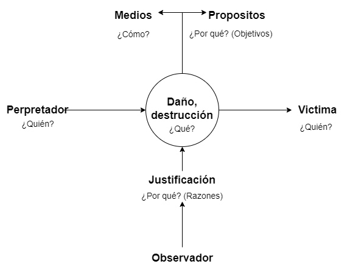
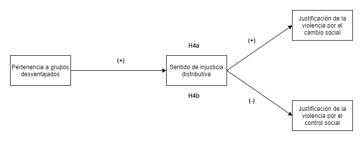
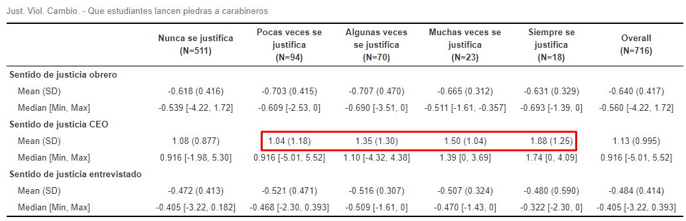
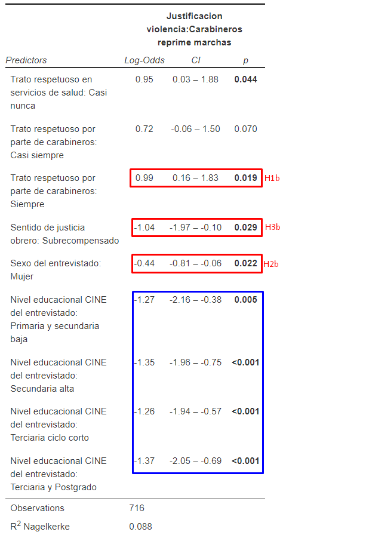

```{r setup, include=FALSE,eval=TRUE}
options(htmltools.dir.version = FALSE)
```

```{r xaringan-themer, include=FALSE, warning=FALSE}
library(xaringanthemer)
library("xaringanExtra")
library("fontawesome")
xaringanExtra::use_progress_bar(color = "red", location = "bottom")
```
class: inverse, right, middle

# ¿Quién justifica qué? _El rol del sentido de injusticia en las justificaciones de violencia en contexto de protesta_ <br>

.medium[.orange[**Martín Venegas Márquez** (martin.venegas@ug.uchile.cl)]]


.small[Facultad de Ciencias Sociales, Universidad de Chile] <br> 


***
.medium[[.orange[_Coloquio de Investigación en Desigualdad y Ciudadanía - **Primer Semestre 2022**_]](https://github.com/formacionciudadana)]<br>
.medium[Abril, 2022]

---
class: slideInRight, middle, inverse

***
# Contenidos
***

- **Problematización**

- **Pregunta y Objetivos de Investigación** 

- **Conceptos e Hipótesis**

- **Método**

- **Resultados preliminares**

- **Preguntas a la audiencia**
---

class: slideInRight, middle, inverse

***
# Problematización
***

### .medium[Relevancia Social]
### .medium[Relevancia Académica]
### .medium[Contribuciones de este estudio]
---
class: slideInRight, middle, inverse

***
# Problematización
***

### [**Relevancia Social**]()
### .medium[Relevancia Académica]
### .medium[Contribuciones de este estudio]
---
# Violencia

- **Definición:** Ejercicio intencional del daño (enfoque minimalista) (Bufacchi, 2005)

- **Componente principal de la experiencia humana:** guerras, crímenes, abusos.

- **Convivencia humana**: lidiar de alguna forma con la violencia (e.g. contrato social de Hobbes, Estado moderno de Weber).

- **Desafío de las sociedades democráticas:** disminuir los niveles de violencia

## [**¿Erradicable?** Coexistencia con la violencia → Plantear limites para uso o... Justificación de la Violencia]()

---
# Justificación de la Violencia

- **Definición:** Argumentación de que el acto violento trae alguna consecuencia que lo compense (Basaure, 2020; Frazer y Hutchings, 2019)

- **Estado Moderno:** Monopolio de la violencia física -> Agentes representantes del estado ejercen violencia justificada

## [**¿Es siempre así?**]()

- **Contexto de Protesta → Estallido social: Dos reflexiones**

  + 1) El uso de la violencia por parte de agentes representates del Estado (carabineros) no siempre está justificada. **Su justificación ha disminuido (ELSOC, 2020)**
  
  + 2) El uso de la violencia por parte de agentes no estatales (manifestantes) algunas veces se justifica. **Su justificación ha aumentado (ELSOC, 2020)**
---
# Justificación de la Violencia en Contexto de Protesta

## [**Consecuencias:**]() Quienes justifican la violencia son más tenientes a ejercerla (Markowitz, 2001) o a condonar el acto violento de otros (Kalmoe, 2014) -> **Escalada de violencia que amenace la convivencia pacifica**

# [**¿Quienes y por qué justifican la violencia?**]()
---
class: slideInRight, middle, inverse

***
# Problematización
***

### .medium[Relevancia Social]
### [**Relevancia Académica**]()
### .medium[Contribuciones de este estudio]
---
# Distinción del objeto de estudio

En la literatura empírica se distingue la justificación de la violencia de acuerdo a sus **fines**

### [**Justificación de la Violencia por el Cambio Social**]()

Aquella que busca generar cambios en las estructuras jerárquicas de la sociedad (Blumenthal, 1973; Gerber et al. 2018)

### [**Justificación de la Violencia por el Control Social**]() 

Aquella que busca mantener las estructuras jerárquicas de las sociedad. (Blumenthal, 1973; Gerber et al. 2018)
---

# Tres literaturas

### ¿Quién justifica qué y por qué?

1. **Enfoque criminológico de las teorías del conflicto social:** Personas de más bajos estatus o pertenecientes a grupos minoritarios tienden a apoyar menos el _uso de la fuerza por parte de la policía_ (Arthur & Case, 1994; Thompson, 2004)

2. **Enfoque de teorías de Autoritarismo de Derecha (RWA) y Dominancia Social (SDO):** Personas con ideologías más autoritarias (RWA) y dominantes (SDO) tienden a justificar más el _uso de la fuerza excesiva por parte de la policía_ (Gerber y Jackson, 2016)

3. **Enfoque de justicia procesal:** Mayores percepciones de justicia procesal están asociadas a mayor _justificación de la violencia_ por el control social, y menos por el cambio social (Gerber, 2017).

---
# Brechas/Oportunidades

**1.** .large[**Carencia de marco unificado y concepto común.**]

**2.** .large[**Aporte a la evidencia sobre justicia en el trato y pertenencia a grupos desventajados.**]

**3.** .large[**Exploración del rol de la justicia distributiva.**]


---
class: slideInRight, middle, inverse

***
# Problematización
***

### .medium[Relevancia Social]
### .medium[Relevancia Académica]
### [**Contribuciones de este estudio**]()
---
# Tres contribuciones

1. **Revisión conceptual de las justificaciones de violencia.** Propuesta de un modelo para comprender una Situación de Justificación de la Violencia.

2. **Añadir evidencia empírica respecto al rol de las percepciones de justicia en el trato y pertenencia a grupos desventajados.** Uso de datos no analizados y representativos de un momento excepcional.

3. **Integrar la dimensión de justicia distributiva**  

  a) Contribuir a la construcción de una agenda de justificación de la violencia ampliando los factores explicativos.  
  
  b) Contribuir a la agenda de justicia distributiva al elaborar evidencia sobre los consecuencias de la justicia distributiva.
  

---
class: slideInRight, middle, inverse

***
# Pregunta y Objetivos de Investigación
***
---
# Pregunta

> ¿Cuál es la relación entre el sentido de injusticia distributiva, las percepciones de justicia en el trato y la pertenencia a grupos desventajados con las justificaciones de la violencia en contexto de protesta, tanto por el cambio social, como por el control social, en Chile al año 2019?

---
# Objetivos general

> **Determinar** la relación entre el sentido de injusticia, las percepciones de justicia en el trato y la pertenencia a grupos desventajados con las justificaciones de la violencia en contexto de protesta, tanto por el cambio social, como por el control social, en Chile al año 2019

---
# Objetivos especifcos

- **Explicar** la relación entre las percepciones del trato justo y las justificaciones de violencia en contexto de protesta, tanto por el cambio social, como por el control social.

- **Explicar** la relación entre la pertenencia a grupos desventajados y las justificaciones de violencia en contexto de protesta, tanto por el cambio social, como por el control social.

- **Explicar** la relación entre el sentido de injusticia y las justificaciones de violencia en contexto de protesta, tanto por el cambio social, como por el control social.

- **Explorar** el rol mediador del sentido de injusticia en la relación entre grupos desventajados y las justificaciones de violencia en contexto de protesta, tanto por el cambio, como por el control social.
---

class: slideInRight, middle, inverse

***
# Conceptos e Hipótesis
***

### [**Justificación de la Violencia en Contexto de Protesta**]()
### .medium[Percepciones de Trato Justo]
### .medium[Pertenencia a Grupos Desventajados]
### .medium[Sentido de Injusticia]
---

#### Figura 1. Propuesta de modelo para una Situación de Justificación de Violencia



.small[Fuente: elaboración propía a partir de planteamientos de Imbusch (2004) y Jasso (2016)]
---

class: slideInRight, middle, inverse

***
# Conceptos e Hipótesis
***

### .medium[Justificación de la Violencia en Contexto de Protesta]
### [**Percepciones de Trato Justo**]()
### .medium[Pertenencia a Grupos Desventajados]
### .medium[Sentido de Injusticia]
---
# Percepciones de Trato Justo

- **Definición:** Percepciones que tienen los individuos de que son tratados justamente por las autoridades (e.g. carabineros) (Gerber, 2017).

- **Medición:** Ejemplo de ítem -> "Carabineros trata con respeto y dignidad a las personas mapuches" (Gerber et al, 2018)
 
---

# Hipótesis 1

**Antecedentes:** Enfoque de justicia procesal (Gerber et al., 2018)

- *H1a*: Personas que perciban mayor justicia en el trato tenderán a justificar menos la violencia por el cambio social.

- *H1b*: Personas que perciban mayor justicia en el trato tenderán a justificar más la violencia por el control social.

---
class: slideInRight, middle, inverse

***
# Conceptos e Hipótesis
***

### .medium[Justificación de la Violencia en Contexto de Protesta]
### .medium[Percepciones de Trato Justo]
### [**Pertenencia a Grupos Desventajados**]()
### .medium[Sentido de Injusticia]
---
# Pertenencia a Grupos Desventajados

- **Definición:** Individuos que pertenecen a grupos con menos recursos, comúnmente discriminados o con menos oportunidades (Arthur y Case, 1994; Robinson, 1983)

- **Medición:** Ejemplo -> mujeres, personas de raza negra, personas de bajos ingresos.

---
# Hipótesis 2

**Antecedentes:** Enfoque criminológico de las teorías del conflicto social (Thompson, 2004) y otros estudios (Blumenthal, 1973; Gerber et al. 2017)

- *H2a*: Personas pertenecientes a grupos desventajados tenderán a justificar más la violencia por el cambio social.

- *H2b*: Personas pertenecientes a grupos desventajados tenderán a justificar menos la violencia por el control social.
---

class: slideInRight, middle, inverse

***
# Conceptos e Hipótesis
***

### .medium[Justificación de la Violencia en Contexto de Protesta]
### .medium[Percepciones de Trato Justo]
### .medium[Pertenencia a Grupos Desventajados]
### [**Sentido de Injusticia**]()
---
# Sentido de Injusticia

- **Definición:** Ideas que se forman los individuos respecto a qué tan injusta es una situación de distribución de recompensas (Jasso, 2016)

- **Medición:** Evaluaciones de Justicia -> comparaciones entre las recompensas reales (e.g. ingresos) y las recompensas consideradas justas (e.g. ingresos justos) de parte de un individuo.
  + Reflexivas: quien recibe las recompensas y quien evalúa su justicia son las mismas (Observador = Recompensado)
  
  + No Reflexivas: quien recibe las recompensas y quien evalúa su justicia son diferentes (Observador ≠ Recompensado)
---

# Hipótesis 3

**Antecedentes:** Justicia distributiva (Jasso, 2016; Liebig y Sauer, 2016), literatura normativa sobre justificación de la violencia (Reitan, 2002) y relación justificación violencia-violencia (Markowitz, 2001; Kalmoe, 2014)

- *H3a*: Personas que sientan mayor injusticia en la distribución de ingresos del país tenderán a justificar más la violencia por el cambio social.

- *H3b*: Personas que sientan mayor injusticia en la distribución de ingresos del país tenderán a justificar menos la violencia por el control social.


---
# Hipótesis 4

**Antecedentes:** Tesis de la desventaja (Robinson, 1983) y privación relativa (Stewart, 2006; Gurr, 1970)

- *H4a*: Personas pertenecientes a grupos desventajados justifican más la violencia por el cambio social porque sienten mayores niveles de injusticia en la distribución de ingresos

- *H4b*: Personas pertenecientes a grupos desventajados justifican menos la violencia por el control social porque sienten mayores niveles de injusticia en la distribución de ingresos
---
#### Figura 2. Síntesis modelo de hipótesis principal


.small[Fuente: elaboración propia]
---
#### Figura 3. Síntesis modelo de hipótesis de mediación



.small[Fuente: elaboración propia]
---
class: slideInRight, middle, inverse

***
# Método
***
---
# Datos 
  - Encuesta Longitudinal Social de Chile - Ola 4 (2019)
  - 716 casos válidos para el análisis (sin NA en las variables relevantes)

---

# Variable dependiente
**¿En qué medida cree usted que se justifican o no se justifican las siguientes situaciones?**

- Justificación de la Violencia por el Cambio Social
  + Indice de Destrucción a la Propiedad
  + _Que estudiantes tiren piedras a carabineros en una marcha por la educación del país_. Likert 5 categorías: (1) Nunca se justifica a (5) Siempre se justifica.
  
- Justificación de la Violencia por el Control social
  + _Que carabineros desaloje a la fuerza a los estudiantes de un liceo en toma_. Idem.
  + _Que carabineros use la fuerza para reprimir una manifestación pacifica_. Idem.

---
# Variables independientes

**¿Con cuánta frecuencia cree usted que personas [grupo o clase del entrevistado] son tratadas con respeto?...**

- Percepción de trato justo

  + _En los servicios de salud._ Likert 5 categorías: (1) Nunca a (5) Siempre.
  + _Por carabineros._ Idem.

- Pertenencia a grupos desventajados
  + Sexo
  + Ingresos
  + Nivel educacional

---
# Variables independientes

**Preguntas sobre ingresos reales y justos para: el entrevistado, un obrero no calificado, un gerente de una gran empresa**

- Sentido de Injusticia

\begin{equation}
   \text{J}_{i}= ln(\frac{\text{Ingresos reales}_{i}}{\text{Ingresos justos}_{i}})
\end{equation}

Siendo $J_{i}$ la evaluación de justicia $J$ para un individuo ${i}$.

Valores negativos implican injusticia por subrecompensa, el 0 implica situación de justicia perfecta y valores positivos injusticia por sobrerecompensa.

$J_{entrevistado}$ (Reflexiva)  
$J_{obrero}$ (No reflexiva)  
$J_{gerente}$ (No reflexiva)  
---
# Técnicas de análisis

- Regresión lineal múltiple (para Indice de Destrucción a la Propiedad)
- Regresiones logísticas ordinales (para items aislados)
- Modelos de mediación
---

class: slideInRight, middle, inverse

***
# Resultados preliminares
***

### [**Descriptivos**]()
### .medium[Multivariados]
---

#### Tabla 1. Descriptivos de justificación de la violencia

---
#### Tabla 2. Sentido de injusticia por justificación de violencia por el cambio 



**Apoyo descriptivo H3a** -> Quienes consideran que los gerentes están injustamente sobrerecompensados justifican más la violencia por el cambio social.

---
#### Tabla 3. Sentido de injusticia por justificación de violencia por el control social 


**Apoyo descriptivo H3b**

-> Quienes consideran que los obreros están injustamente recompensados justifican menos la violencia por el control social  

-> Quienes se consideran como injustamente recompensados justifican menos la violencia por el control social*

---
class: slideInRight, middle, inverse

***
# Resultados preliminares
***

### .medium[Descriptivos]
### [**Multivariados**]()
---

.pull-left[

]

.pull-right[
#### Tabla 4. Regresión Lógística Ordinal Justificación Violencia por el Control Social
 
- _H1b:_ Quienes consideran justo el trato de carabineros justifican más la violencia por el control social

- _H2b:_ Quienes sienten más injusticia en la distribución de ingresos justifican menos la violencia por el control social (_.large[**J**].small[obrero]_)

- _H3b:_ Quienes pertenecen a grupos más desventajados justifican menos la violencia por el control social (Mujeres)
]
---
class: slideInRight, middle, inverse

***
# Preguntas a la audiencia
***
---
# Preguntas

- ¿Dicotomizar variables dependientes? -> Modelos Logit Binarios

- ¿Lectura de coeficientes de sentido de injusticia? -> ¿Se pueden leer lineales?
---
class: slideInRight, middle, inverse

***
# Anexos
***
---
#### Figura 4. Modelo de Situación de Justificación de la Violencia del estudio


.small[Fuente: elaboración propía a partir de planteamientos de Imbusch (2004) y Jasso (2016)]

---
class: slideInRight, middle, inverse, center

# ¡Muchas Gracias!
