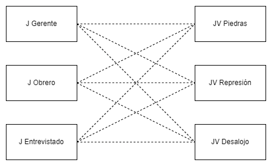
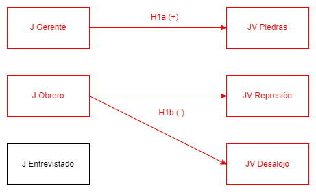

```{r setup, include=FALSE,eval=TRUE}
options(htmltools.dir.version = FALSE)
```

```{r xaringan-themer, include=FALSE, warning=FALSE}
library(xaringanthemer)
library("xaringanExtra")
library("fontawesome")
xaringanExtra::use_progress_bar(color = "red", location = "bottom")
```
class: inverse

# ¿Quién justifica qué? _El rol del sentido de injusticia en las justificaciones de violencia en contexto de protesta_ <br>

.medium[.orange[**Martín Venegas Márquez** (martin.venegas@ug.uchile.cl)]]


.small[Facultad de Ciencias Sociales, Universidad de Chile] <br> 


***
.medium[[.orange[_Seminario OLES - **Segundo Semestre 2022**_]](https://github.com/formacionciudadana)]<br>
.medium[Septiembre, 2022]

---
class: slideInRight, middle, inverse

***
# Contenidos
***

- **Problematización**

- **Pregunta y Objetivos de Investigación** 

- **Hipótesis**

- **Método**

- **Resultados**

- **Discusión y Conclusiones**
---

class: slideInRight, middle, inverse

***
# Problematización
***

### .medium[Objeto de Estudio]
### .medium[Contexto]
### .medium[Relevancia Social]
### .medium[Relevancia Académica]
### .medium[Este estudio]
---
class: slideInRight, middle, inverse

***
# Problematización
***

### [**Objeto de Estudio**]()
### .medium[Contexto]
### .medium[Relevancia Social]
### .medium[Relevancia Académica]
### .medium[Este estudio]
---

# Violencia

--

- Concepto complejo → múltiples definiciones
- El ejercicio intencional del daño (Buffachi, 2005)  
- Elemento de reflexión a lo largo de la historia → Ejemplo, Weber y el Estado

--

# Justificación de la Violencia

--

- Plantear limites a la violencia o situaciones en donde se justifique
- Argumentación de que el acto violento trae alguna consecuencia que lo compense (Basaure, 2020; Frazer y Hutchings, 2019)


---
class: slideInRight, middle, inverse

***
# Problematización
***

### .medium[Objeto de Estudio]
### [**Contexto**]()
### .medium[Relevancia Social]
### .medium[Relevancia Académica]
### .medium[Este estudio]

---
# Justificación de la Violencia

--

.pull-left[

**Contexto de Protesta → Estallido social: Dos reflexiones**


1) El uso de la violencia por parte de agentes representates del Estado (carabineros) no siempre está justificada. **Su justificación ha disminuido (ELSOC, 2020)**
  
2) El uso de la violencia por parte de agentes no estatales (manifestantes) algunas veces se justifica. **Su justificación ha aumentado (ELSOC, 2020)**
  
]

--

.pull-right[.center[
```{r justintro, echo=FALSE, message=FALSE, warning=FALSE, fig.cap="Justificación de la Violencia de Carabineros y Manifestantes por año"}

pacman::p_load(tidyverse,sjPlot, sjmisc, sjlabelled, elsoc, ggplot2, ggrepel, ordinal) # librerias
knitr::opts_chunk$set(warning = FALSE,  # mensaje de warning
                      message = FALSE,  # mensajes/avisos de librerias  
                      cache = FALSE,    # cache de los chunks,usar analisis pesados
                      # out.width = '50%',# largo de imagen en %
                      fig.pos= "H",     # posicion figuras H = HERE
                      echo = FALSE      # incluir chunk en output
)

elsoc::load_elsoc('long')

elsoc_long_2016_2021 <-elsoc_long_2016_2021[!(elsoc_long_2016_2021$ola == 5),]

elsoc_long_2016_2021 %>% 
  filter(tipo_atricion == 1 & muestra == 1 & 
           !f05_03 %in% c(-888, -999) & !f05_04 %in% c(-888, -999) & !f05_07 %in% c(-888, -999)) %>% 
  dplyr::select(f05_03, f05_04, f05_07, ola, ponderador02, segmento_disenno, estrato_disenno) %>% 
  pivot_longer(cols = c(f05_03, f05_04, f05_07)) %>% 
  prop(value %in% 4:5, by = c(ola, name), na.rm = TRUE) %>% 
  mutate(name = factor(name,
                       levels = c('f05_03', 'f05_04', 'f05_07'),
                       labels = c('Carabineros use la fuerza para\n reprimir manifestación pacífica',
                                  'Carabineros desaloje a la fuerza\na estudiantes de liceo en toma',
                                  'Estudiantes tiren piedras a Carabi-\nneros en marcha por la educación'))) %>%
  sjlabelled::as_label(ola) %>% 
  ggplot(aes(y = prop, x = ola, color = name, group = name,
             label = scales::percent(prop, accuracy = .1))) +
  theme_bw() + 
  geom_point(size = 1.75) + 
  geom_line() +
  scale_y_continuous(labels = scales::percent,
                     limits = c(0, .5)) +
  ylab(label = NULL) +
  xlab(label = NULL) +
  scale_color_viridis_d(begin = 0, end = .7, option = 'viridis') + 
  ggrepel::geom_text_repel(size = 3, nudge_y = .02) +
  theme(plot.caption = element_text(hjust = 0),
        legend.position = 'top',
        legend.title = element_blank()) +
  
    scale_x_continuous(breaks = c(1,2,3,4), labels=c("2016", 
                            "2017", 
                            "2018", 
                            "2019")) +
  ggtitle(NULL,
        subtitle = 'Porcentaje que responde que Muchas veces o Siempre se justifica' ) +
  labs(caption = 'Fuente: COES (2022) Radiografía del Cambio Social: Análisis de Resultados Longitudinales ELSOC 2016-2021. Presentación de Resultados COES. Enero, Santiago de Chile.\nNota: Se consideran observaciones de individuos sin atrición entre olas. N=7.507 (1.513 individuos)')
```
]]

---
# Justificación de la Violencia en Contexto de Protesta

--

### [**Consecuencias:**]() Quienes justifican la violencia son más tenientes a ejercerla (Markowitz, 2001) o a condonar el acto violento de otros (Kalmoe, 2014) -> **Escalada de violencia que amenace la convivencia pacifica**

--

### [**¿Quienes y por qué justifican la violencia?**]()

---
class: slideInRight, middle, inverse

***
# Problematización
***

### .medium[Objeto de Estudio]
### .medium[Contexto]
### [**Relevancia Social**]()
### .medium[Relevancia Académica]
### .medium[Este estudio]

---
class: slideInRight, middle, inverse

***
# Problematización
***

### .medium[Objeto de Estudio]
### .medium[Contexto]
### .medium[Relevancia Social]
### [**Relevancia Académica**]()
### .medium[Este estudio]

---
# Distinción Principal

--

En la literatura empírica se distingue la justificación de la violencia de acuerdo a sus **fines**

--

.pull-left[### [**Justificación de la Violencia por el Cambio Social**]()

Aquella que busca generar cambios en las estructuras jerárquicas de la sociedad (Blumenthal, 1973; Gerber et al. 2018)
]
--

.pull-right[### [**Justificación de la Violencia por el Control Social**]() 

Aquella que busca mantener las estructuras jerárquicas de las sociedad. (Blumenthal, 1973; Gerber et al. 2018)
]
---

# Tres explicaciones desde la literatura

--

1. **Enfoque criminológico de las teorías del conflicto social:** Personas de más bajos estatus o pertenecientes a grupos minoritarios tienden a apoyar menos el _uso de la fuerza por parte de la policía_ (Arthur & Case, 1994; Thompson, 2004)

--

2. **Enfoque de teorías de Autoritarismo de Derecha (RWA) y Dominancia Social (SDO):** Personas con ideologías más autoritarias (RWA) y dominantes (SDO) tienden a justificar más el _uso de la fuerza excesiva por parte de la policía_ (Gerber y Jackson, 2016)

--

3. **Enfoque de justicia procesal:** Mayores percepciones de justicia procesal están asociadas a mayor _justificación de la violencia_ por el control social, y menos por el cambio social (Gerber, 2017).

---
class: slideInRight, middle, inverse

***
# Problematización
***

### .medium[Objeto de Estudio]
### .medium[Contexto]
### .medium[Relevancia Social]
### .medium[Relevancia Académica]
### [**Este Estudio**]()
---
# Este estudio

--

## Premisa 

--

.large[### La justicia no es un concepto unidimensional, sino uno multidimensional]

--

Las dos dimensiones más trabajadas en la literatura:  

  + **Distributiva:** Justicia en la distribución de recompensas (generalmente ingresos)
  
  + **Procesal:** Justicia en el trato a personas (generalmente de parte de autoridades)
  
---
# Este estudio
## Propuesta 

--

### Integrar la justicia distributiva como una dimensión explicativa de las justificaciones de la violencia

--

### Pero... ¿por qué?

---

# Este estudio: Planteamiento Lógico

--

- Las ideas de justicia distributiva son una fuerza social que motivan el comportamiento humano a nivel individual y agregado

--

#### .center[Injusticia Distributiva → Acción]

--

- Quienes justifican la violencia son más tendientes a ejercerla o a condonar la violencia de otros

--

#### .center[Justificación → Acción]

--

- Entonces, _alguien que ejerce violencia en función de su sentimiento de injusticia distributiva debería previamente justificarla_

--

#### .center[Injusticia Distributiva → Justificación → Acción]

---
# Literatura hasta ahora...

.center[]
---
# Literatura hasta ahora...

.center[]
---
# Literatura hasta ahora...

.center[]
---
class: slideInRight, middle, inverse

***
# Pregunta y Objetivos de Investigación
***
---
# Pregunta

> ¿Cuál es la relación entre el sentido de injusticia distributiva y las justificaciones de la violencia en contexto de protesta, tanto por el cambio social, como por el control social, en Chile al año 2019?

---
# Objetivos general

> Determinar la relación entre el sentido de injusticia distributiva y las justificaciones de la violencia en contexto de protesta, tanto por el cambio social, como por el control social, en Chile al año 2019

---
# Objetivos especifcos

--

- Caracterizar la justificación de la violencia en contexto de protesta, tanto por el cambio, cómo por el control social.

--

- Determinar la relación entre el sentido de injusticia distributiva y las justificaciones de violencia en contexto de protesta, tanto por el cambio social, como por el control social.

--

- Determinar el efecto del sentido de injusticia distributiva en la relación entre grupos desaventajados y justificaciones de violencia, tanto por el cambio social, cómo por el control social.
---
class: slideInRight, middle, inverse

***
# Hipótesis
***
---
# Hipótesis

--

$H_{1a}$: Individuos que evalúen la distribución de ingresos como más injusta tenderán a justificar más la violencia por el cambio social.

--

$H_{1b}$: Individuos que evalúen la distribución de ingresos como menos injusta tenderán a justificar más la violencia por el control social.

--

.center[]

---
# Hipótesis

--

$H_{2a}$: Individuos pertenecientes a grupos desaventajados tenderán a justificar más la violencia por el cambio social cuando evalúen la distribución de ingresos como más injusta.

--

$H_{2b}$: Individuos pertenecientes a grupos desaventajados tenderán a justificar menos la violencia por el control social cuando evalúen la distribución de ingresos como más injusta

--

.center[]
---
class: slideInRight, middle, inverse

***
# Método
***
---
# Datos 

--

  - Encuesta Longitudinal Social de Chile - Ola 4 (2019)
  - 716 casos válidos para el análisis (sin NA en las variables relevantes)

---

# Variables Dependientes

--

¿En qué medida cree usted que se justifican o no se justifican las siguientes situaciones?

--
.pull-left[**Justificación de la Violencia por el Cambio Social**

_1. Que estudiantes tiren piedras a carabineros en una marcha por la educación del país_.   
  
]
  
--
  
.pull-right[**Justificación de la Violencia por el Control Social**

 _2. Que carabineros desaloje a la fuerza a los estudiantes de un liceo en toma_.  
  
 _3. Que carabineros use la fuerza para reprimir una manifestación pacifica_.
 
]

--

.center[(1) Nunca se justifica a (5) Siempre se justifica.]
---
# Variables Independientes

--

**Preguntas sobre ingresos reales y justos para: el entrevistado, un obrero no calificado, un gerente de una gran empresa**

--

**Sentido de Injusticia Distributiva**

\begin{equation}
   \text{J}_{i}= ln(\frac{\text{Ingresos Reales}_{i}}{\text{Ingresos Justos}_{i}})
\end{equation}

--

Siendo $J_{i}$ la evaluación de justicia $J$ para un individuo ${i}$ → A mayor valor en el indicador, más injusticia se evalúa.

--

- $J_{entrevistado}$ (Reflexiva)  

--

- $J_{obrero}$ (No reflexiva)  

--

- $J_{gerente}$ (No reflexiva)  
---
# Controles

--

.pull-left[**Pertenencia a grupos desaventajados**  
Sexo (Mujer)  
Ingresos (Bajos Ingresos)  
Nivel educacional (Bajo Nivel)
Pertenencia a Pueblo Originario (Mapuche)  
]

.pull-right[
**Ideología**  

Indice RWA (Autoritarismo)  
Indice SDO (Dominancia Social)  

]

.pull-right[**Percepción de Trato Justo**

¿Con cuánta frecuencia cree usted que personas [grupo o clase del entrevistado] son tratadas con respeto?...

_En los servicios de salud._   
_Por carabineros._   

]
--

---
# Síntesis: Hipótesis y Variables

.center[]

---
# Técnicas de análisis
     
.pull-left[
**Descriptivos**  

Análisis de frecuencias, distribución y medidas tendencia central  

Correlaciones de Pearson  

]

.pull-right[**Multivariados**

Análisis de Regresión Logística Ordinal  

Inclusión de efectos de interacción

] 
---
class: slideInRight, middle, inverse

***
# Resultados
***
---

# Descriptivos Justificación Violencia

```{r pjv, echo=FALSE, message=FALSE, warning=FALSE, fig.cap="Frecuencias de Justificación de la Violencia", fig.width=10}

load(url("https://github.com/thesis-justification-of-violence/thesis-analysis/raw/main/input/data/procjv_analysis_nona.RData"))

load(url("https://github.com/thesis-justification-of-violence/thesis-analysis/raw/main/input/data/procjv_nums_nona.RData"))

if (!require("pacman")) install.packages("pacman")  #si falta pacman, instalar
if (!require("tinytex")) install.packages("tinytex")#si falta tinytex, instalar
pacman::p_load(knitr, kableExtra, dplyr, lavaan, sjPlot, ordinal, sjmisc, sjlabelled, ggrepel, readxl, MASS, brant) # librerias
knitr::opts_chunk$set(warning = FALSE,  # mensaje de warning
                      message = FALSE,  # mensajes/avisos de librerias  
                      cache = FALSE,    # cache de los chunks,usar analisis pesados
                      # out.width = '50%',# largo de imagen en %
                      fig.pos= "H",     # posicion figuras H = HERE
                      echo = FALSE      # incluir chunk en output
)

# Otras configuraciones
options(scipen=999) # notacion cientifica
options(knitr.kable.NA = '') # NA en kable = ''

  # update.packages("sjPlot") # please install version 2.8.9 or above
  ggplot2::theme_set(ggplot2::theme(panel.background = ggplot2::element_rect(fill = "gray85",
                                                                             colour = "gray85"),
                                    panel.border = ggplot2::element_blank(),
                                    axis.text.y = ggplot2::element_text(size = 11,
                                                                        hjust = 1),
                                    title = ggplot2::element_text(size = 11,
                                                                  face = "bold"),
                                    legend.text = ggplot2::element_text(size = 10),
                                    plot.caption = ggplot2::element_text(size = 9,
                                                                         face = "plain",
                                                                         hjust = 1)))
  #Plot : Perception of meritocracy student and family
  
  data_plot <- dplyr::select(procjv_nums_nona, 
                      jv_est_2019,
                      jv_carab1_2019,
                      jv_carab2_2019)
  
  data_plot$jv_est_2019 <- factor(data_plot$jv_est_2019, levels = c(5,4,3,2,1), labels = c("Siempre", "Muchas veces", "Algunas veces", "Pocas veces", "Nunca"))
  data_plot$jv_est_2019 <- set_label(data_plot$jv_est_2019, label = "JV: Piedras")

  data_plot$jv_carab1_2019 <- factor(data_plot$jv_carab1_2019, levels = c(5,4,3,2,1), labels = c("Siempre", "Muchas veces", "Algunas veces", "Pocas veces", "Nunca"))
  data_plot$jv_carab1_2019 <- set_label(data_plot$jv_carab1_2019, label = "JV: Represion")
  
  data_plot$jv_carab2_2019 <- factor(data_plot$jv_carab2_2019, levels = c(5,4,3,2,1), labels = c("Siempre", "Muchas veces", "Algunas veces", "Pocas veces", "Nunca"))
  data_plot$jv_carab2_2019 <- set_label(data_plot$jv_carab2_2019, label = "JV: Desalojo")
  
  pjv<-
    data_plot%>%
    dplyr::select(jv_est_2019,
           jv_carab1_2019,
           jv_carab2_2019) %>%
    sjPlot::plot_likert(geom.colors = "PuBu",
                        geom.size = 0.8,
                        catcount = 5,
                        # axis.labels = c("JV: Estudiantes lancen piedras","JV: Carabineros repriman marchas ","JV: Carabineros desalojen tomas"),
                        # legend.labels = c("Nunca","Pocas veces","Algunas veces","Muchas veces","Siempre"),
                        # grid.range  =  c(1.2 , 1.2),
                        values  =  "sum.outside",
                        reverse.colors = F,
                        reverse.scale = F,
                        show.n = FALSE) +
    # guides(colour = guide_legend(reverse = TRUE))
    theme(legend.position="bottom") +
    labs(caption =
           paste0("Fuente: Elaboración propia  a partir de ELSOC 2019"," (n=",dim(na.omit(procjv_analysis_nona))[1],")")) + guides(colour = guide_legend(reverse = TRUE)) + theme_classic()
  
  sjPlot::plot_grid(list(pjv),tags = c("",""))
```
---
# Probabilidades J Gerente → JV Piedras

.pull-left[
```{r predjvest4}

load(url("https://github.com/thesis-justification-of-violence/thesis-analysis/raw/main/input/data/procjv_analysis_nona.RData"))

jv_est_2019.modelmulpub4<- clm(jv_est_2019_factor ~ 
                                 sj_ceo_rec + 
                                 sj_obrero_rec + 
                                 sj_entrevistado + 
                                 ingreso + 
                                 sexo_factor + 
                                 ingreso_satisfact_factor + 
                                 educ_rec_factor + 
                                 indigena_rec_factor + 
                                 sdo_indice + 
                                 rwa_indice + 
                                 trato_salud_factor + 
                                 trato_carab_factor, 
                               data = procjv_analysis_nona)

plot_pred_jvest_4 <- plot_model(jv_est_2019.modelmulpub4, type = "pred", terms = c("sj_ceo_rec[all]"), title = "")  + geom_line() + theme(legend.position="bottom") + ylab("Probabilidad Predicha")

plot_pred_jvest_4$data$response.level[plot_pred_jvest_4$data$response.level == 1] <- "1. Nunca"
plot_pred_jvest_4$data$response.level[plot_pred_jvest_4$data$response.level == 2] <- "2. Pocas veces"
plot_pred_jvest_4$data$response.level[plot_pred_jvest_4$data$response.level == 3] <- "3. Algunas veces"
plot_pred_jvest_4$data$response.level[plot_pred_jvest_4$data$response.level == 4] <- "4. Muchas veces"
plot_pred_jvest_4$data$response.level[plot_pred_jvest_4$data$response.level == 5] <- "5. Siempre"

plot_pred_jvest_4 + theme_classic()


```

]

.pull-right[

**A medida que aumenta la evaluación de que los gerentes están injustamente sobrerecompensados...**  

...disminuye la probabilidad de responder que nunca se justifica que estudiantes tiren piedras a carabineros (controlando por variables relevantes)  

...aumenta la probabilidad de responder que muchas veces se justifica que estudiantes tiren piedras a carabineros (controlando por variables relevantes)

]

---

# Probabilidades J Obrero → JV Represión


.pull-left[
```{r predcarab1_2}

load(url("https://github.com/thesis-justification-of-violence/thesis-analysis/raw/main/input/data/procjv_analysis_nona.RData"))


 jv_carab1_2019.modelmulpub2<- clm(jv_carab1_2019_factor ~ 
                                     sj_ceo_rec + 
                                     sj_obrero_rec + 
                                     sj_entrevistado + 
                                     ingreso + 
                                     sexo_factor + 
                                     ingreso_satisfact_factor + 
                                     educ_rec_factor + 
                                     indigena_rec_factor, 
                                   data = procjv_analysis_nona)

plot_pred_carab1_2 <- plot_model(jv_carab1_2019.modelmulpub2, type = "pred", terms = c("sj_obrero_rec[all]"), title = "")  + geom_line() + theme(legend.position="bottom") + ylab("Probabilidad Predicha")

plot_pred_carab1_2$data$response.level[plot_pred_carab1_2$data$response.level == 1] <- "1. Nunca"
plot_pred_carab1_2$data$response.level[plot_pred_carab1_2$data$response.level == 2] <- "2. Pocas veces"
plot_pred_carab1_2$data$response.level[plot_pred_carab1_2$data$response.level == 3] <- "3. Algunas veces"
plot_pred_carab1_2$data$response.level[plot_pred_carab1_2$data$response.level == 4] <- "4. Muchas veces"
plot_pred_carab1_2$data$response.level[plot_pred_carab1_2$data$response.level == 5] <- "5. Siempre"

plot_pred_carab1_2 + theme_classic()


```
]

.pull-left[

**A medida que aumenta la evaluación de que los obreros están injustamente subrerecompensados...**  

...aumenta la probabilidad de responder que nunca se justifica que carabineros reprima marchas pacificas (controlando por variables relevantes)  

...disminuye la probabilidad de responder que muchas veces se justifica que carabineros reprima marchas pacificas (controlando por variables relevantes)

]

---

# Probabilidades J Obrero → JV Desalojo


.pull-left[
```{r predcarab2_4}

load(url("https://github.com/thesis-justification-of-violence/thesis-analysis/raw/main/input/data/procjv_analysis_nona.RData"))


jv_carab2_2019.modelmulpub4<- clm(jv_carab2_2019_factor ~ 
                                    sj_ceo_rec + 
                                    sj_obrero_rec +
                                    sj_entrevistado_rec + 
                                    ingreso +
                                    sexo_factor + 
                                    ingreso_satisfact_factor + 
                                    educ_rec_factor +
                                    indigena_rec_factor +
                                    sdo_indice + 
                                    rwa_indice + 
                                    trato_salud_factor +
                                    trato_carab_factor, 
                                  data = procjv_analysis_nona)

plot_pred_carab2_4 <- plot_model(jv_carab2_2019.modelmulpub4, type = "pred", terms = c("sj_obrero_rec[all]"), title = "")  + geom_line() + theme(legend.position="bottom") + ylab("Probabilidad Predicha")

plot_pred_carab2_4$data$response.level[plot_pred_carab2_4$data$response.level == 1] <- "1. Nunca"
plot_pred_carab2_4$data$response.level[plot_pred_carab2_4$data$response.level == 2] <- "2. Pocas veces"
plot_pred_carab2_4$data$response.level[plot_pred_carab2_4$data$response.level == 3] <- "3. Algunas veces"
plot_pred_carab2_4$data$response.level[plot_pred_carab2_4$data$response.level == 4] <- "4. Muchas veces"
plot_pred_carab2_4$data$response.level[plot_pred_carab2_4$data$response.level == 5] <- "5. Siempre"

plot_pred_carab2_4 + theme_classic()
```
]

.plot-right[
**A medida que aumenta la evaluación de que los obreros están injustamente subrerecompensados... ** 

...aumenta la probabilidad de responder que nunca se justifica que carabineros desaloje tomas estudiantiles (controlando por variables relevantes  

...disminuye la probabilidad de responder que muchas veces se justifica que carabineros desaloje tomas estudiantiles (controlando por variables relevantes)

]

---
# Resultados: Efectos Directos (H1a y H1b)

.center[]
---
# Resultados: Efectos Directos (H1a y H1b)

.center[]
---
# Resultados: Efectos Directos (H1a y H1b)

.center[]
---
# Resultados: Efectos Directos (H1a y H1b)

.center[]
---
class: slideInRight, middle, inverse

***
# Discusión y Conclusiones
***

---
class: slideInRight, middle, inverse

***
# Anexos
***

---

# Descriptivos: Sentido Injusticia

```{r den-sj, echo=FALSE, fig.cap="Distribución del sentido de injusticia", fig.width=10}
load(url("https://github.com/thesis-justification-of-violence/thesis-analysis/raw/main/input/data/procjv_analysis_nona.RData"))

load(url("https://github.com/thesis-justification-of-violence/thesis-analysis/raw/main/input/data/procjv_nums_nona.RData"))

if (!require("pacman")) install.packages("pacman")  #si falta pacman, instalar
if (!require("tinytex")) install.packages("tinytex")#si falta tinytex, instalar
pacman::p_load(knitr, kableExtra, dplyr, lavaan, sjPlot, ordinal, sjmisc, sjlabelled, ggrepel) # librerias
knitr::opts_chunk$set(warning = FALSE,  # mensaje de warning
                      message = FALSE,  # mensajes/avisos de librerias  
                      cache = FALSE,    # cache de los chunks,usar analisis pesados
                      # out.width = '50%',# largo de imagen en %
                      fig.pos= "H",     # posicion figuras H = HERE
                      echo = FALSE      # incluir chunk en output
)

# Otras configuraciones
options(scipen=999) # notacion cientifica
options(knitr.kable.NA = '') # NA en kable = ''


 # update.packages("sjPlot") # please install version 2.8.9 or above
  ggplot2::theme_set(ggplot2::theme(panel.background = ggplot2::element_rect(fill = "gray85",
                                                                             colour = "gray85"),
                                    panel.border = ggplot2::element_blank(),
                                    axis.text.y = ggplot2::element_text(size = 13,
                                                                        hjust = 1),
                                    title = ggplot2::element_text(size = 13,
                                                                  face = "bold"),
                                    legend.text = ggplot2::element_text(size = 12),
                                    plot.caption = ggplot2::element_text(size = 10,
                                                                         face = "plain",
                                                                         hjust = 1)))
a <- data.frame(procjv_nums_nona$sj_obrero_rec);
a$grupo <- "Obrero"
names(a) <- c("promedio","Recompensado:")

b <- data.frame(procjv_nums_nona$sj_ceo);
b$grupo <- "Gerente"
names(b) <- c("promedio","Recompensado:")

c <- data.frame(procjv_nums_nona$sj_entrevistado_rec);
c$grupo <- "Entrevistado"
names(c) <- c("promedio","Recompensado:")

df_sj<- rbind(c,b,a)
  ggplot(df_sj) +
  geom_density(aes(x=promedio,fill=`Recompensado:`
), alpha=0.4) +
  scale_x_continuous(name = "Sentido de Injusticia (J)",
                     breaks=-5:5,
                     labels = as.character(-5:5)) +
  ylab("Density")+
  theme(legend.position="bottom") + theme_classic() +
    labs(caption =
           paste0("Fuente: Elaboración propia  a partir de ELSOC 2019"," (n=",dim(na.omit(procjv_analysis_nona))[1],")"))
  
```

---

# Descriptivos

```{r sj-jvcamb, fig.cap="Medias del Sentido de Injusticia por Justificación de la Violencia por el Cambio Social", fig.width=10}
# table1::table1(~sj_obrero + sj_ceo + sj_entrevistado | jv_est_2019_factor, data = procjv_analysis_nona, caption = "Just. Viol. Cambio. - Que estudiantes lancen piedras a carabineros")

# df_plot_jvest <- procjv_analysis_nona %>%
#   group_by(jv_est_2019_factor) %>%
#   summarise_at(vars(sj_ceo, sj_obrero_rec, sj_entrevistado_rec), list(name = mean))

if (!require("pacman")) install.packages("pacman")  #si falta pacman, instalar
if (!require("tinytex")) install.packages("tinytex")#si falta tinytex, instalar
pacman::p_load(knitr, kableExtra, dplyr, lavaan, sjPlot, ordinal, sjmisc, sjlabelled, ggrepel) # librerias
knitr::opts_chunk$set(warning = FALSE,  # mensaje de warning
                      message = FALSE,  # mensajes/avisos de librerias  
                      cache = FALSE,    # cache de los chunks,usar analisis pesados
                      # out.width = '50%',# largo de imagen en %
                      fig.pos= "H",     # posicion figuras H = HERE
                      echo = FALSE      # incluir chunk en output
)


df <- data.frame(x=c(1, 2, 3, 4, 5, 
                     1, 2, 3, 4, 5, 
                     1, 2, 3, 4, 5),
                 y=c(1.08, 1.02, 1.36, 1.52, 1.86, 
                     0.62, 0.72, 0.71, 0.62, 0.61, 
                     0.47, 0.51, 0.52, 0.50, 0.51),
                 Recompensado = c("Gerente", "Gerente","Gerente","Gerente","Gerente",
                       "Obrero", "Obrero", "Obrero", "Obrero", "Obrero", 
                       "Entrevistado", "Entrevistado","Entrevistado","Entrevistado","Entrevistado"))

#create scatterplot with a label on every point
ggplot(df, aes(x,y,group =Recompensado, name = Recompensado, color = Recompensado)) +
  geom_line(color = "gray")+
  geom_point(aes(colour = Recompensado), size = 4) +
  geom_text_repel(aes(label = y)) +
  labs(y = "Sentido de Injusticia (J)", x = "JV: Piedras", Recompensado="") + theme_classic() +
  ggtitle("") + 
  scale_x_continuous(breaks = c(1,2,3,4,5), labels=c("Nunca", 
                            "Pocas veces", 
                            "Algunas veces", 
                            "Muchas veces",
                            "Siempre")) +
    labs(caption =
           paste0("Fuente: Elaboración propia  a partir de ELSOC 2019"," (n=",dim(na.omit(procjv_analysis_nona))[1],")"))


```

---

# Descriptivos

```{r sj-jvcon1, fig.cap = "Medias del Sentido de Injusticia por Jusitificación de la Violencia por el Control Social 1", fig.width=10}

#table1::table1(~sj_obrero_rec + sj_ceo + sj_entrevistado_rec | jv_carab1_2019_factor, data = procjv_analysis_nona, caption = "Just. Viol. Control - Carabineros reprima marchas")

if (!require("pacman")) install.packages("pacman")  #si falta pacman, instalar
if (!require("tinytex")) install.packages("tinytex")#si falta tinytex, instalar
pacman::p_load(knitr, kableExtra, dplyr, lavaan, sjPlot, ordinal, sjmisc, sjlabelled, ggrepel) # librerias
knitr::opts_chunk$set(warning = FALSE,  # mensaje de warning
                      message = FALSE,  # mensajes/avisos de librerias  
                      cache = FALSE,    # cache de los chunks,usar analisis pesados
                      # out.width = '50%',# largo de imagen en %
                      fig.pos= "H",     # posicion figuras H = HERE
                      echo = FALSE      # incluir chunk en output
)


df <- data.frame(x=c(1, 2, 3, 4, 5, 
                     1, 2, 3, 4, 5, 
                     1, 2, 3, 4, 5),
                 y=c(1.16, 0.97, 1.08, 1.19, 0.50, 
                     0.68, 0.56, 0.54, 0.59, 0.41, 
                     0.51, 0.39, 0.44, 0.56, 0.29),
                 Recompensado = c("Gerente", "Gerente","Gerente","Gerente","Gerente",
                       "Obrero", "Obrero", "Obrero", "Obrero", "Obrero", 
                       "Entrevistado", "Entrevistado","Entrevistado","Entrevistado","Entrevistado"))

#create scatterplot with a label on every point
ggplot(df, aes(x,y,group =Recompensado, name = Recompensado, color = Recompensado)) +
  geom_line(color = "gray")+
  geom_point(aes(colour = Recompensado), size = 4) +
  geom_text_repel(aes(label = y)) +
  labs(y = "Sentido de Injusticia (J)", x = "JV: Represion", Recompensado="") + theme_classic() +
  ggtitle("") + 
  scale_x_continuous(breaks = c(1,2,3,4,5), labels=c("Nunca", 
                            "Pocas veces", 
                            "Algunas veces", 
                            "Muchas veces",
                            "Siempre")) +
    labs(caption =
           paste0("Fuente: Elaboración propia  a partir de ELSOC 2019"," (n=",dim(na.omit(procjv_analysis_nona))[1],")"))


```

---

# Descriptivos

```{r sj-jvcon2, fig.cap = "Medias del Sentido de Injusticia por Jusitificación de la Violencia por el Control Social 2", fig.width=10}

#table1::table1(~sj_obrero_rec + sj_ceo + sj_entrevistado_rec | jv_carab2_2019_factor, data = procjv_analysis_nona, caption = "Just. Viol. Control - Carabineros desaloje liceos en toma")

if (!require("pacman")) install.packages("pacman")  #si falta pacman, instalar
if (!require("tinytex")) install.packages("tinytex")#si falta tinytex, instalar
pacman::p_load(knitr, kableExtra, dplyr, lavaan, sjPlot, ordinal, sjmisc, sjlabelled, ggrepel) # librerias
knitr::opts_chunk$set(warning = FALSE,  # mensaje de warning
                      message = FALSE,  # mensajes/avisos de librerias  
                      cache = FALSE,    # cache de los chunks,usar analisis pesados
                      # out.width = '50%',# largo de imagen en %
                      fig.pos= "H",     # posicion figuras H = HERE
                      echo = FALSE      # incluir chunk en output
)

df <- data.frame(x=c(1, 2, 3, 4, 5, 
                     1, 2, 3, 4, 5, 
                     1, 2, 3, 4, 5),
                 y=c(1.19, 0.99, 1.07, 1.24, 0.77, 
                     0.69, 0.61, 0.57, 0.46, 0.50, 
                     0.53, 0.44, 0.43, 0.39, 0.29),
                 Recompensado = c("Gerente", "Gerente","Gerente","Gerente","Gerente",
                       "Obrero", "Obrero", "Obrero", "Obrero", "Obrero", 
                       "Entrevistado", "Entrevistado","Entrevistado","Entrevistado","Entrevistado"))

#create scatterplot with a label on every point
ggplot(df, aes(x,y,group =Recompensado, name = Recompensado, color = Recompensado)) +
  geom_line(color = "gray")+
  geom_point(aes(colour = Recompensado), size = 4) +
  geom_text_repel(aes(label = y)) +
  labs(y = "Sentido de Injusticia (J)", x = "JV: Desalojo", Recompensado="") + theme_classic() +
  ggtitle("") + 
  scale_x_continuous(breaks = c(1,2,3,4,5), labels=c("Nunca", 
                            "Pocas veces", 
                            "Algunas veces", 
                            "Muchas veces",
                            "Siempre")) +
    labs(caption =
           paste0("Fuente: Elaboración propia a partir de ELSOC 2019"," (n=",dim(na.omit(procjv_analysis_nona))[1],")"))


```

---
# Multivariados

---

class: slideInRight, middle, inverse, center

# ¡Muchas Gracias!
